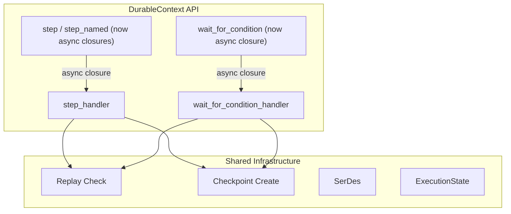
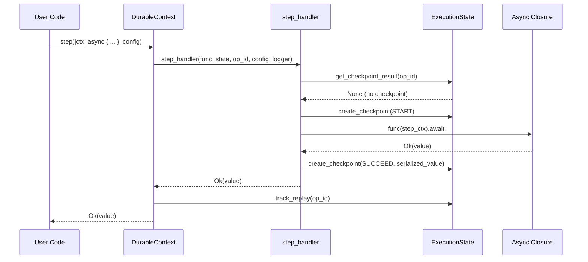
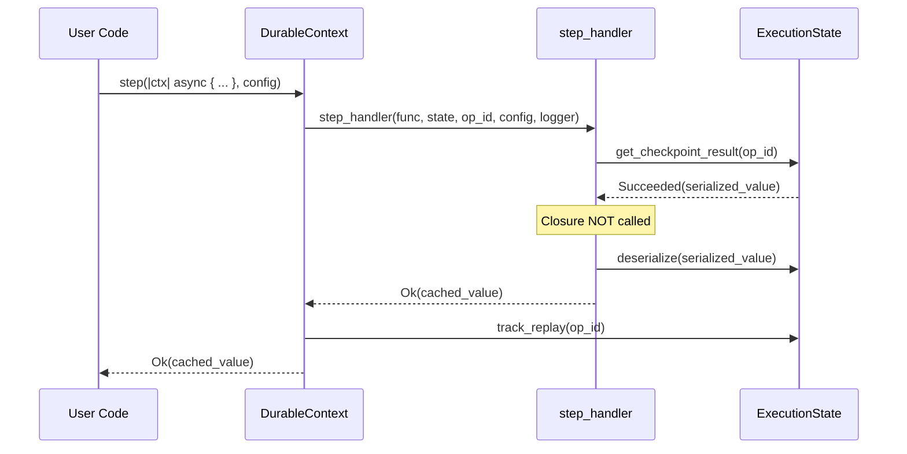
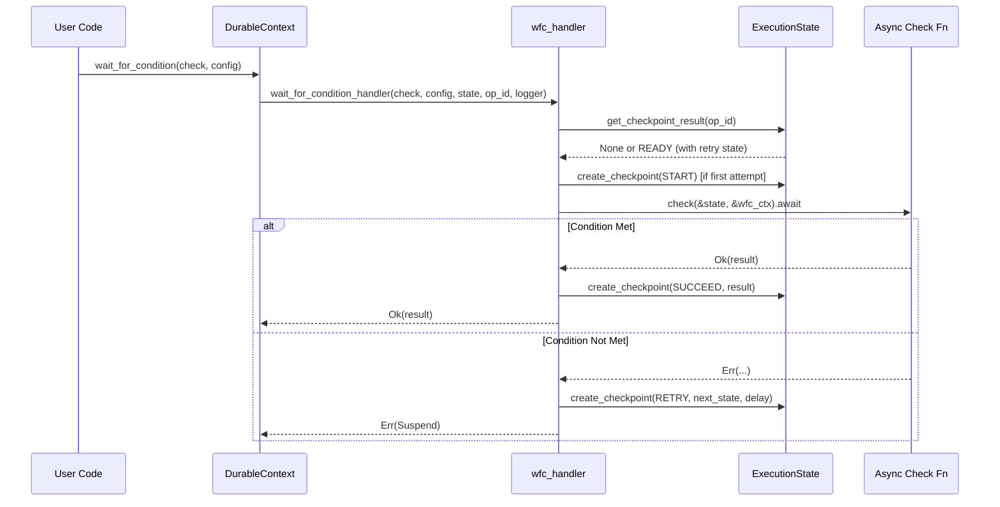

# Design Document: Async Step Support

## Overview

The durable execution SDK's `step`, `step_named`, and `wait_for_condition` operations currently only accept synchronous closures. This makes it difficult to use async libraries (e.g., AWS SDK for Rust, HTTP clients) inside these operations, forcing users into awkward workarounds like `tokio::runtime::Handle::block_on`.

Since the crate is at version 0.1.0-alpha2 and the API is not yet stable, this feature changes `step`, `step_named`, and `wait_for_condition` **in-place** to accept async closures using the `F + Fut` two-generic pattern already established by `map`, `parallel`, and `run_in_child_context`. This is a breaking change — existing sync callers must wrap their closures in `async move { ... }` — but is acceptable for an alpha release. No new method variants are introduced.

The checkpoint/replay logic is identical to the current sync path — during replay, cached results are returned without re-executing the closure — so the change is purely at the closure invocation boundary. The `StepFn` trait alias is replaced with an `AsyncStepFn` trait alias (or removed entirely), and the `execute_with_retry` helper is updated to `.await` the closure's future. No new operation types or checkpoint formats are introduced.

## Architecture

The existing methods on `DurableContext` are modified in-place. The handler functions gain additional generic parameters (`Fut`) but otherwise share the same checkpoint/replay infrastructure.



## Sequence Diagrams

### Step — First Execution (No Replay)



### Step — Replay Path



### Wait For Condition — Polling Flow



## Components and Interfaces

### Component 1: StepFn Trait Alias (Breaking Change)

The existing `StepFn` trait alias in `traits.rs` currently requires a synchronous closure:

```rust
// BEFORE (current)
pub trait StepFn<T>:
    FnOnce(StepContext) -> Result<T, Box<dyn std::error::Error + Send + Sync>> + Send
{}
```

This is replaced with an async-aware version using the `F + Fut` two-generic pattern. Since Rust trait aliases cannot cleanly express associated future types with blanket impls, the simplest approach is to **remove `StepFn` entirely** and use explicit `F + Fut` bounds at each call site, matching the pattern already used by `map`, `parallel`, and `run_in_child_context`.

Alternatively, if a trait alias is desired for readability, it can be kept as documentation but the actual bounds on `step`/`step_named` will use the two-generic pattern directly:

```rust
// AFTER — bounds used directly on step/step_named
where
    T: DurableValue,
    F: FnOnce(StepContext) -> Fut + Send,
    Fut: std::future::Future<Output = Result<T, Box<dyn std::error::Error + Send + Sync>>> + Send,
```

**Responsibilities**:
- Remove or deprecate the sync-only `StepFn` trait alias
- All call sites that previously used `F: StepFn<T>` switch to `F: FnOnce(StepContext) -> Fut + Send` + `Fut: Future<...> + Send`

### Component 2: DurableContext Methods (In-Place Change)

The existing `step`, `step_named`, and `wait_for_condition` methods are modified in-place to accept async closures.

```rust
impl DurableContext {
    // BEFORE: F: StepFn<T>  (sync closure)
    // AFTER:  F + Fut pattern (async closure)
    pub async fn step<T, F, Fut>(
        &self,
        func: F,
        config: Option<StepConfig>,
    ) -> DurableResult<T>
    where
        T: DurableValue,
        F: FnOnce(StepContext) -> Fut + Send,
        Fut: std::future::Future<Output = Result<T, Box<dyn std::error::Error + Send + Sync>>> + Send;

    pub async fn step_named<T, F, Fut>(
        &self,
        name: &str,
        func: F,
        config: Option<StepConfig>,
    ) -> DurableResult<T>
    where
        T: DurableValue,
        F: FnOnce(StepContext) -> Fut + Send,
        Fut: std::future::Future<Output = Result<T, Box<dyn std::error::Error + Send + Sync>>> + Send;

    // BEFORE: F: Fn(&S, &WaitForConditionContext) -> Result<T, ...> + Send + Sync
    // AFTER:  F + Fut pattern (async closure)
    pub async fn wait_for_condition<T, S, F, Fut>(
        &self,
        check: F,
        config: WaitForConditionConfig<S>,
    ) -> DurableResult<T>
    where
        T: serde::Serialize + serde::de::DeserializeOwned + Send,
        S: serde::Serialize + serde::de::DeserializeOwned + Clone + Send + Sync,
        F: Fn(&S, &WaitForConditionContext) -> Fut + Send + Sync,
        Fut: std::future::Future<Output = Result<T, Box<dyn std::error::Error + Send + Sync>>> + Send;
}
```

**Responsibilities**:
- Generate operation identifiers (unchanged)
- Delegate to updated handler functions
- Track replay after completion (unchanged)

### Component 3: Handler Functions (In-Place Change)

The existing handler functions in `handlers/step.rs` and `handlers/wait_for_condition.rs` are updated to accept async closures.

```rust
// In handlers/step.rs — MODIFIED (was sync F: StepFn<T>)
pub async fn step_handler<T, F, Fut>(
    func: F,
    state: &Arc<ExecutionState>,
    op_id: &OperationIdentifier,
    config: &StepConfig,
    logger: &Arc<dyn Logger>,
) -> StepResult<T>
where
    T: DurableValue,
    F: FnOnce(StepContext) -> Fut + Send,
    Fut: std::future::Future<Output = Result<T, Box<dyn std::error::Error + Send + Sync>>> + Send;

// In handlers/wait_for_condition.rs — MODIFIED (was sync F: Fn(...) -> Result)
pub async fn wait_for_condition_handler<T, S, F, Fut>(
    check: F,
    config: WaitForConditionConfig<S>,
    state: &Arc<ExecutionState>,
    op_id: &OperationIdentifier,
    logger: &Arc<dyn Logger>,
) -> Result<T, DurableError>
where
    T: serde::Serialize + serde::de::DeserializeOwned + Send,
    S: serde::Serialize + serde::de::DeserializeOwned + Clone + Send + Sync,
    F: Fn(&S, &WaitForConditionContext) -> Fut + Send + Sync,
    Fut: std::future::Future<Output = Result<T, Box<dyn std::error::Error + Send + Sync>>> + Send;
```

**Responsibilities**:
- Replay detection and cached result return (unchanged)
- Async closure invocation via `.await` (changed from sync call)
- Checkpoint creation (unchanged)
- Error mapping from `Box<dyn Error>` to `DurableError` (unchanged)

## Data Models

No new data models are introduced. The modified methods use the same:

- `StepContext` — passed to the async closure, same fields
- `WaitForConditionConfig<S>` — same polling configuration
- `WaitForConditionContext` — same attempt tracking
- `StepConfig` — same retry/semantics configuration
- `OperationUpdate` — same checkpoint format (START, SUCCEED, FAIL, RETRY)
- `OperationType::Step` — same operation type in checkpoints

The checkpoint format is identical because the async/sync distinction only affects how the closure is invoked, not what gets stored.

## Algorithmic Pseudocode

### step_handler (Modified)

The only change from the current implementation is the addition of the `Fut` generic parameter and `.await`-ing the closure result instead of calling it synchronously.

```rust
pub async fn step_handler<T, F, Fut>(
    func: F,
    state: &Arc<ExecutionState>,
    op_id: &OperationIdentifier,
    config: &StepConfig,
    logger: &Arc<dyn Logger>,
) -> StepResult<T>
where
    T: DurableValue,
    F: FnOnce(StepContext) -> Fut + Send,
    Fut: Future<Output = Result<T, Box<dyn Error + Send + Sync>>> + Send,
{
    // 1. Tracing span — unchanged
    let span = create_operation_span("step", op_id, state.durable_execution_arn());
    let _guard = span.enter();

    // 2. Check for existing checkpoint (replay) — unchanged
    let checkpoint_result = state.get_checkpoint_result(&op_id.operation_id).await;
    let skip_start = checkpoint_result.is_ready();
    let attempt = checkpoint_result.attempt().unwrap_or(0);
    let retry_payload = checkpoint_result.retry_payload().map(|s| s.to_string());

    if let Some(result) = handle_replay::<T>(&checkpoint_result, state, op_id, logger).await? {
        return Ok(result);
    }

    // 3. Build StepContext — unchanged
    let step_ctx = build_step_context(op_id, state, attempt, retry_payload);
    let serdes = JsonSerDes::<T>::new();
    let serdes_ctx = step_ctx.serdes_context();

    // 4. Execute based on semantics — delegates to async-aware helpers
    match config.step_semantics {
        StepSemantics::AtMostOncePerRetry => {
            execute_at_most_once(func, state, op_id, &step_ctx, &serdes, &serdes_ctx, config, logger, skip_start).await
        }
        StepSemantics::AtLeastOncePerRetry => {
            execute_at_least_once(func, state, op_id, &step_ctx, &serdes, &serdes_ctx, config, logger).await
        }
    }
}
```

**Preconditions:**
- `state` is a valid `Arc<ExecutionState>` with an active checkpoint store
- `op_id` is a deterministically generated, unique operation identifier
- `func` is a `FnOnce` that has not been previously called

**Postconditions:**
- If replay: returns cached `Ok(T)` or cached `Err(DurableError)` without calling `func`
- If first execution: `func` is called exactly once, result is checkpointed, and returned
- A checkpoint (SUCCEED or FAIL) exists for `op_id` after successful return
- `func` is consumed (moved) regardless of execution path

**Loop Invariants:** N/A (no loops)

### execute_at_most_once (Modified)

The key change: `execute_with_retry` previously called `func(step_ctx)` synchronously. Now it calls `func(step_ctx).await`.

```rust
async fn execute_at_most_once<T, F, Fut>(
    func: F,
    state: &Arc<ExecutionState>,
    op_id: &OperationIdentifier,
    step_ctx: &StepContext,
    serdes: &JsonSerDes<T>,
    serdes_ctx: &SerDesContext,
    config: &StepConfig,
    logger: &Arc<dyn Logger>,
    skip_start_checkpoint: bool,
) -> StepResult<T>
where
    T: DurableValue,
    F: FnOnce(StepContext) -> Fut + Send,
    Fut: Future<Output = Result<T, Box<dyn Error + Send + Sync>>> + Send,
{
    // Checkpoint START before execution — unchanged
    if !skip_start_checkpoint {
        state.create_checkpoint(create_start_update(op_id), true).await?;
    }

    // Execute the async closure — CHANGED: was sync func(step_ctx), now .await
    let result = func(step_ctx.clone()).await;

    // Checkpoint the result — unchanged
    match result {
        Ok(value) => {
            let serialized = serdes.serialize(&value, serdes_ctx)?;
            state.create_checkpoint(create_succeed_update(op_id, Some(serialized)), true).await?;
            Ok(value)
        }
        Err(error) => {
            let error_obj = ErrorObject::new("UserCodeError", error.to_string());
            state.create_checkpoint(create_fail_update(op_id, error_obj), true).await?;
            Err(DurableError::UserCode { message: error.to_string(), error_type: "UserCodeError".to_string(), stack_trace: None })
        }
    }
}
```

**Preconditions:**
- START checkpoint either already exists (skip_start_checkpoint=true) or will be created before execution
- `func` has not been previously called

**Postconditions:**
- START checkpoint exists before `func` is called (at-most-once guarantee)
- SUCCEED or FAIL checkpoint exists after return
- `func` is called exactly once

### execute_at_least_once (Modified)

Same change: `.await` on the closure instead of sync call.

```rust
async fn execute_at_least_once<T, F, Fut>(
    func: F,
    state: &Arc<ExecutionState>,
    op_id: &OperationIdentifier,
    step_ctx: &StepContext,
    serdes: &JsonSerDes<T>,
    serdes_ctx: &SerDesContext,
    config: &StepConfig,
    logger: &Arc<dyn Logger>,
) -> StepResult<T>
where
    T: DurableValue,
    F: FnOnce(StepContext) -> Fut + Send,
    Fut: Future<Output = Result<T, Box<dyn Error + Send + Sync>>> + Send,
{
    // Execute the async closure FIRST (no START checkpoint) — CHANGED: .await
    let result = func(step_ctx.clone()).await;

    // Checkpoint AFTER execution — unchanged
    match result {
        Ok(value) => {
            let serialized = serdes.serialize(&value, serdes_ctx)?;
            state.create_checkpoint(create_succeed_update(op_id, Some(serialized)), true).await?;
            Ok(value)
        }
        Err(error) => {
            let error_obj = ErrorObject::new("UserCodeError", error.to_string());
            state.create_checkpoint(create_fail_update(op_id, error_obj), true).await?;
            Err(DurableError::UserCode { message: error.to_string(), error_type: "UserCodeError".to_string(), stack_trace: None })
        }
    }
}
```

**Preconditions:**
- `func` has not been previously called

**Postconditions:**
- `func` is called before any checkpoint is created (at-least-once guarantee)
- SUCCEED or FAIL checkpoint exists after return
- If Lambda crashes between `func` completion and checkpoint, `func` may execute again on retry

### execute_with_retry (Modified)

The current `execute_with_retry` calls `func(step_ctx)` synchronously. It must be changed to an async function that `.await`s the closure's future.

```rust
// BEFORE (sync):
// fn execute_with_retry<T, F>(func: F, step_ctx: StepContext, ...) -> Result<T, ...>
// where F: FnOnce(StepContext) -> Result<T, ...> + Send

// AFTER (async):
async fn execute_with_retry<T, F, Fut>(
    func: F,
    step_ctx: StepContext,
    config: &StepConfig,
    logger: &Arc<dyn Logger>,
    log_info: &LogInfo,
) -> Result<T, Box<dyn std::error::Error + Send + Sync>>
where
    T: Send,
    F: FnOnce(StepContext) -> Fut + Send,
    Fut: Future<Output = Result<T, Box<dyn std::error::Error + Send + Sync>>> + Send,
{
    if config.retry_strategy.is_some() {
        logger.debug(
            "Retry strategy configured but not yet implemented for consumed closures",
            log_info,
        );
    }

    // CHANGED: .await on the closure's future
    let result = func(step_ctx).await;

    // Retryable error filter logic — unchanged
    if let Err(ref err) = result {
        if let Some(ref filter) = config.retryable_error_filter {
            let error_msg = err.to_string();
            if !filter.is_retryable(&error_msg) {
                return result;
            }
        }
    }

    result
}
```

### wait_for_condition_handler (Modified)

The only change is `.await`-ing the check closure call.

```rust
pub async fn wait_for_condition_handler<T, S, F, Fut>(
    check: F,
    config: WaitForConditionConfig<S>,
    state: &Arc<ExecutionState>,
    op_id: &OperationIdentifier,
    logger: &Arc<dyn Logger>,
) -> Result<T, DurableError>
where
    T: Serialize + DeserializeOwned + Send,
    S: Serialize + DeserializeOwned + Clone + Send + Sync,
    F: Fn(&S, &WaitForConditionContext) -> Fut + Send + Sync,
    Fut: Future<Output = Result<T, Box<dyn Error + Send + Sync>>> + Send,
{
    // 1. Check replay — unchanged
    let checkpoint_result = state.get_checkpoint_result(&op_id.operation_id).await;
    if let Some(result) = handle_replay::<T>(&checkpoint_result, state, op_id, logger).await? {
        return Ok(result);
    }

    // 2. Determine current attempt and state — unchanged
    let (current_attempt, user_state) = get_current_state::<S>(&checkpoint_result, &config)?;
    let check_ctx = WaitForConditionContext { attempt: current_attempt, max_attempts: None };

    // 3. Checkpoint START if first attempt — unchanged
    if current_attempt == 1 && !checkpoint_result.is_existent() {
        state.create_checkpoint(create_start_update(op_id), true).await?;
    }

    // 4. Execute the async condition check — CHANGED: .await on check()
    match check(&user_state, &check_ctx).await {
        Ok(result) => {
            // Condition met — checkpoint success (unchanged)
            let serdes = JsonSerDes::<T>::new();
            let serdes_ctx = SerDesContext::new(&op_id.operation_id, state.durable_execution_arn());
            let serialized = serdes.serialize(&result, &serdes_ctx)?;
            state.create_checkpoint(create_succeed_update(op_id, Some(serialized)), true).await?;
            Ok(result)
        }
        Err(e) => {
            // Condition not met — consult wait_strategy (unchanged)
            let decision = (config.wait_strategy)(&user_state, current_attempt);
            match decision {
                WaitDecision::Done => {
                    let error = ErrorObject::new("MaxAttemptsExceeded", format!("Last error: {}", e));
                    state.create_checkpoint(create_fail_update(op_id, error), true).await?;
                    Err(DurableError::Execution { message: "Max attempts exceeded".into(), termination_reason: TerminationReason::ExecutionError })
                }
                WaitDecision::Continue { delay } => {
                    // Checkpoint RETRY with next state and suspend — unchanged
                    let next_state = WaitForConditionState { user_state: user_state.clone(), attempt: current_attempt + 1 };
                    let serialized_state = serialize_state(&next_state, op_id, state)?;
                    state.create_checkpoint(create_retry_update(op_id, Some(serialized_state), Some(delay.to_seconds())), true).await?;
                    Err(DurableError::Suspend { scheduled_timestamp: None })
                }
            }
        }
    }
}
```

**Preconditions:**
- `check` is `Fn` (not `FnOnce`) — it can be called on each poll attempt
- `config.initial_state` is serializable and clonable
- `config.wait_strategy` is a valid strategy function

**Postconditions:**
- If replay with SUCCEED: returns cached result without calling `check`
- If replay with FAIL: returns cached error without calling `check`
- If replay with PENDING/RETRY: returns `Suspend` to re-poll later
- If first/continued execution: `check` is called once, result determines checkpoint action
- On condition met: SUCCEED checkpoint created
- On condition not met + continue: RETRY checkpoint created, returns Suspend
- On condition not met + done: FAIL checkpoint created

**Loop Invariants:** N/A (single poll per invocation; looping is handled by Lambda re-invocation)

## Key Functions with Formal Specifications

### Function: step (Modified In-Place)

```rust
// BEFORE: pub async fn step<T, F>(&self, func: F, config: Option<StepConfig>) -> DurableResult<T>
//         where T: DurableValue, F: StepFn<T>
// AFTER:
pub async fn step<T, F, Fut>(&self, func: F, config: Option<StepConfig>) -> DurableResult<T>
where
    T: DurableValue,
    F: FnOnce(StepContext) -> Fut + Send,
    Fut: Future<Output = Result<T, Box<dyn Error + Send + Sync>>> + Send,
```

**Preconditions:**
- `self` is a valid `DurableContext` with active state
- `T` implements `Serialize + DeserializeOwned + Send`
- `func` returns a `Send` future

**Postconditions:**
- Returns `Ok(T)` if closure succeeds or replay has cached success
- Returns `Err(DurableError)` if closure fails or replay has cached failure
- Operation ID is deterministically generated and unique within the execution
- Checkpoint exists for the operation after return (unless Suspend)

### Function: step_named (Modified In-Place)

```rust
// BEFORE: pub async fn step_named<T, F>(&self, name: &str, func: F, config: Option<StepConfig>) -> DurableResult<T>
//         where T: DurableValue, F: StepFn<T>
// AFTER:
pub async fn step_named<T, F, Fut>(&self, name: &str, func: F, config: Option<StepConfig>) -> DurableResult<T>
where
    T: DurableValue,
    F: FnOnce(StepContext) -> Fut + Send,
    Fut: Future<Output = Result<T, Box<dyn Error + Send + Sync>>> + Send,
```

**Preconditions:**
- Same as `step`
- `name` is a non-empty human-readable string

**Postconditions:**
- Same as `step`
- Operation identifier includes the provided name for debugging/tracing

### Function: wait_for_condition (Modified In-Place)

```rust
// BEFORE: pub async fn wait_for_condition<T, S, F>(&self, check: F, config: WaitForConditionConfig<S>) -> DurableResult<T>
//         where F: Fn(&S, &WaitForConditionContext) -> Result<T, Box<dyn Error + Send + Sync>> + Send + Sync
// AFTER:
pub async fn wait_for_condition<T, S, F, Fut>(&self, check: F, config: WaitForConditionConfig<S>) -> DurableResult<T>
where
    T: Serialize + DeserializeOwned + Send,
    S: Serialize + DeserializeOwned + Clone + Send + Sync,
    F: Fn(&S, &WaitForConditionContext) -> Fut + Send + Sync,
    Fut: Future<Output = Result<T, Box<dyn Error + Send + Sync>>> + Send,
```

**Preconditions:**
- `check` is `Fn` (callable multiple times across Lambda invocations)
- `S` is serializable for checkpoint state persistence
- `config.wait_strategy` returns valid `WaitDecision` values

**Postconditions:**
- Returns `Ok(T)` when condition is met (or replay has cached success)
- Returns `Err(Suspend)` when condition not met and retry is scheduled
- Returns `Err(Execution)` when max attempts exceeded
- `check` is called at most once per Lambda invocation

## Example Usage

```rust
use durable_execution_sdk::{DurableContext, DurableError, StepConfig};

// Async step with AWS SDK call — the primary use case
let order_id: String = ctx.step(|_step_ctx| async move {
    let client = aws_sdk_dynamodb::Client::new(&aws_config::load_from_env().await);
    let result = client.put_item()
        .table_name("orders")
        .item("pk", AttributeValue::S("order-123".into()))
        .send()
        .await
        .map_err(|e| Box::new(e) as Box<dyn std::error::Error + Send + Sync>)?;
    Ok("order-123".to_string())
}, None).await?;

// Async named step with HTTP client
let response: String = ctx.step_named("call_external_api", |_step_ctx| async move {
    let resp = reqwest::get("https://api.example.com/data")
        .await?
        .text()
        .await?;
    Ok(resp)
}, None).await?;

// Simple sync logic — just wrap in async move
let simple: i32 = ctx.step(|_| async move { Ok(42) }, None).await?;

// Async wait for condition — poll an external API until ready
let result: OrderStatus = ctx.wait_for_condition(
    |state: &OrderState, _wfc_ctx| {
        let order_id = state.order_id.clone();
        async move {
            let client = reqwest::Client::new();
            let resp: OrderStatus = client
                .get(format!("https://api.example.com/orders/{}", order_id))
                .send()
                .await?
                .json()
                .await?;
            if resp.status == "completed" {
                Ok(resp)
            } else {
                Err("Order not ready yet".into())
            }
        }
    },
    WaitForConditionConfig::from_interval(
        OrderState { order_id: "123".to_string() },
        Duration::from_seconds(10),
        Some(30),
    ),
).await?;
```

## Correctness Properties

*A property is a characteristic or behavior that should hold true across all valid executions of a system — essentially, a formal statement about what the system should do. Properties serve as the bridge between human-readable specifications and machine-verifiable correctness guarantees.*

### Property 1: Step replay skips closure execution

*For any* step operation and *for any* DurableValue type T, if a SUCCEED or FAIL checkpoint exists for the operation ID, the async closure is not invoked and the cached result (or cached error) is returned unchanged.

**Validates: Requirements 3.1, 3.2, 7.3**

### Property 2: Wait-for-condition replay skips closure execution

*For any* wait_for_condition operation and *for any* serializable result type T, if a SUCCEED or FAIL checkpoint exists for the operation ID, the async check closure is not invoked and the cached result (or cached error) is returned unchanged.

**Validates: Requirements 3.3, 3.4**

### Property 3: Non-determinism detection

*For any* step operation, if a checkpoint exists with an OperationType different from Step, the Step_Handler returns a NonDeterministic error without invoking the async closure.

**Validates: Requirement 4.1**

### Property 4: Execution ordering respects step semantics

*For any* step operation with AtMostOnce_Semantics, a START checkpoint is created before the async closure is invoked. *For any* step operation with AtLeastOnce_Semantics, the async closure is invoked before any checkpoint is created.

**Validates: Requirements 5.1, 5.2**

### Property 5: Step error wrapping and checkpointing

*For any* error message returned by an async step closure, the Step_Handler wraps it in `DurableError::UserCode` with the original message and creates a FAIL checkpoint containing the error.

**Validates: Requirements 5.4, 11.1, 11.2**

### Property 6: Checkpoint format parity

*For any* DurableValue type T and *for any* value of that type, the checkpoint created by the async step handler uses OperationType::Step and the same JSON serialization format as the previous sync implementation, such that checkpoints are interchangeable between sync and async implementations.

**Validates: Requirements 7.1, 7.2, 7.3**

### Property 7: Operation ID determinism

*For any* sequence of step operations at the same positions in a workflow, the operation IDs generated are identical regardless of whether the closures are sync-wrapped-in-async or natively async.

**Validates: Requirement 9.1**

### Property 8: Wait-for-condition checkpoint correctness

*For any* wait_for_condition execution: if the async check returns Ok, a SUCCEED checkpoint is created with the serialized result; if the check returns Err and the wait strategy returns Continue, a RETRY checkpoint is created with the next state and delay; if the check returns Err and the wait strategy returns Done, a FAIL checkpoint is created.

**Validates: Requirements 10.1, 10.2, 10.3**

### Property 9: Wait-for-condition single invocation per poll

*For any* wait_for_condition execution (non-replay), the async check closure is called at most once per Lambda invocation.

**Validates: Requirement 10.4**

## Error Handling

### Error Scenario 1: Async Closure Returns Error

**Condition**: The async closure returns `Err(Box<dyn Error + Send + Sync>)`
**Response**: Error is wrapped in `DurableError::UserCode` with the error message, checkpointed as FAIL
**Recovery**: On replay, the cached FAIL checkpoint is returned without re-executing the closure

### Error Scenario 2: Async Closure Panics

**Condition**: The async closure panics during `.await`
**Response**: Panic propagates up through the tokio runtime (same behavior as sync path)
**Recovery**: Lambda retries the execution; the operation has no SUCCEED checkpoint, so it re-executes

### Error Scenario 3: Checkpoint Failure After Async Execution

**Condition**: The async closure succeeds but `create_checkpoint` fails
**Response**: Returns `DurableError::Checkpoint` to the caller
**Recovery**: Lambda retries; for at-least-once semantics, the closure may execute again

### Error Scenario 4: Non-Deterministic Replay

**Condition**: During replay, the checkpoint has a different operation type than expected
**Response**: Returns `DurableError::NonDeterministic` immediately without calling the closure
**Recovery**: Requires investigation — the workflow code changed between executions

## Testing Strategy

### Unit Testing Approach

- Update all existing `step_handler` tests to pass async closures (wrap sync closures in `async move { ... }`)
- Update all existing `wait_for_condition_handler` tests similarly
- Test `step_handler` with mock `ExecutionState` for: success, failure, replay-success, replay-failure, non-deterministic detection
- Test `execute_at_most_once` verifies START checkpoint before closure execution
- Test `execute_at_least_once` verifies no START checkpoint before closure execution
- Test `wait_for_condition_handler` for: condition-met, condition-not-met-retry, condition-not-met-done, replay paths
- Add new tests with genuinely async closures (e.g., `tokio::time::sleep` inside the closure) to verify `.await` works correctly
- All tests use `tokio::test` with mock clients

### Property-Based Testing Approach

**Property Test Library**: proptest

- For any `DurableValue` type T, serializing and deserializing through the step path produces the same value
- For any checkpoint state (Succeeded, Failed, Started), the handler produces the same replay behavior as before the change
- The operation ID generated for step at position N is identical regardless of whether the closure is sync-wrapped-in-async or natively async

### Integration Testing Approach

- Update all existing history-based replay tests (JSON history files) to use async closures — these tests validate that existing checkpoint histories still replay correctly
- Update all examples in `examples/src/bin/` to use `async move { ... }` wrappers
- Update all integration tests in `examples/tests/` (step_tests.rs, wait_tests.rs, etc.)
- Add new integration tests using actual async operations (e.g., `tokio::time::sleep`) inside steps

## Scope of Breaking Changes

The following files require updates to use `async move { ... }` wrappers:

### SDK Core
- `sdk/src/context.rs` — `step`, `step_named`, `wait_for_condition` method signatures
- `sdk/src/handlers/step.rs` — `step_handler`, `execute_at_most_once`, `execute_at_least_once`, `execute_with_retry` signatures and closure invocation
- `sdk/src/handlers/wait_for_condition.rs` — `wait_for_condition_handler` signature and closure invocation
- `sdk/src/traits.rs` — Remove or replace `StepFn` trait alias

### Examples (async move wrappers)
- All binaries in `examples/src/bin/` that use `ctx.step(...)` or `ctx.step_named(...)`

### Tests (async move wrappers)
- `examples/tests/step_tests.rs`
- `examples/tests/wait_tests.rs`
- `examples/tests/hello_world_tests.rs`
- `examples/tests/comprehensive_tests.rs`
- `examples/tests/advanced_tests.rs`
- `examples/tests/error_handling_tests.rs`
- `examples/tests/concurrency_tests.rs`
- `examples/tests/context_validation_tests.rs`
- `examples/tests/serde_tests.rs`
- `examples/tests/callback_tests.rs`
- `examples/tests/child_context_tests.rs`
- `examples/tests/invoke_tests.rs`
- `examples/tests/parallel_map_tests.rs`
- `examples/tests/promise_combinator_tests.rs`
- Unit tests within `sdk/src/handlers/step.rs`
- Unit tests within `sdk/src/handlers/wait_for_condition.rs`
- Unit tests within `sdk/src/traits.rs`

## Performance Considerations

- The change adds one `.await` point compared to the sync path — negligible overhead since the checkpoint I/O already requires async
- No additional allocations beyond what the user's async closure requires
- The `Future` returned by the closure is polled in-place (no `Box::pin` needed at the handler level since the future type is generic)
- `wait_for_condition` has the same polling overhead as before — one check per Lambda invocation
- Sync closures wrapped in `async move { ... }` compile to a zero-cost future (the async block completes immediately on first poll)

## Security Considerations

- No new attack surface — async closures have the same trust boundary as sync closures
- The `Send + Sync` bounds ensure thread safety for the async runtime
- Checkpoint data format is unchanged, so existing encryption/signing applies

## Dependencies

No new dependencies. The feature uses:
- `std::future::Future` (standard library)
- `tokio` (already a workspace dependency for the async runtime)
- Existing SDK infrastructure: `ExecutionState`, `JsonSerDes`, `OperationIdentifier`, `StepContext`
