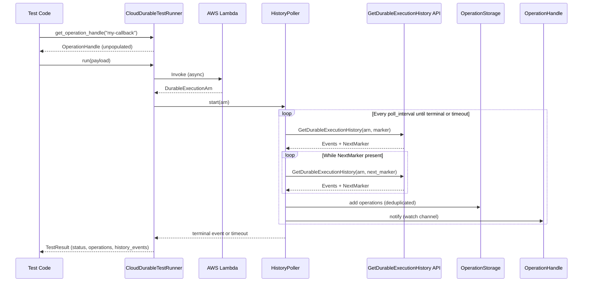

# Design Document: Rust Cloud Testing Parity

## Overview

This design closes the cloud testing parity gap between the Rust and JavaScript SDKs by adding history polling, operation tracking, and callback interaction to the Rust `CloudDurableTestRunner`. Today, the Rust runner invokes a Lambda and returns immediately with the raw response. After this change, `run()` will invoke the Lambda, poll `GetDurableExecutionHistory` for operation events, populate `OperationStorage`, notify waiting `OperationHandle` instances, and return a `TestResult` that reflects the full execution outcome including all history events.

The design introduces a single new struct, `HistoryPoller`, and modifies the existing `CloudDurableTestRunner` to wire it into the `run()` flow. The existing `OperationHandle`, `OperationStorage`, `CallbackSender`, and `CloudTestRunnerConfig` types are reused with minimal changes.

## Architecture



## Components and Interfaces

### HistoryPoller (new)

A struct responsible for periodically calling the `GetDurableExecutionHistory` API and processing the results. It lives in a new file `history_poller.rs` within the testing crate.

```rust
/// Trait abstracting the history API call for testability.
#[async_trait]
pub trait HistoryApiClient: Send + Sync {
    async fn get_history(
        &self,
        arn: &str,
        marker: Option<&str>,
    ) -> Result<HistoryPage, TestError>;
}

/// A single page of history results.
pub struct HistoryPage {
    pub events: Vec<HistoryEvent>,
    pub operations: Vec<Operation>,
    pub next_marker: Option<String>,
    pub is_terminal: bool,
    pub terminal_status: Option<ExecutionStatus>,
    pub terminal_result: Option<String>,
    pub terminal_error: Option<TestResultError>,
}

/// Polls GetDurableExecutionHistory and feeds results into OperationStorage.
pub struct HistoryPoller<C: HistoryApiClient> {
    api_client: C,
    durable_execution_arn: String,
    poll_interval: Duration,
    last_marker: Option<String>,
    max_retries: usize,  // default 3
}
```

Key methods:

- `new(api_client, arn, poll_interval) -> Self` — constructor
- `async poll_once(&mut self) -> Result<PollResult, TestError>` — executes one poll cycle (with pagination and retries), returns new operations, events, and whether a terminal state was reached
- `async call_with_retries(&self, marker: Option<&str>) -> Result<HistoryPage, TestError>` — single API call with up to 3 retries using exponential backoff

`PollResult` is a struct:

```rust
pub struct PollResult {
    pub operations: Vec<Operation>,
    pub events: Vec<HistoryEvent>,
    pub terminal: Option<TerminalState>,
}

pub struct TerminalState {
    pub status: ExecutionStatus,
    pub result: Option<String>,
    pub error: Option<TestResultError>,
}
```

### HistoryApiClient implementations

A `LambdaHistoryApiClient` wraps the `LambdaClient` and calls `GetDurableExecutionHistoryCommand`. A `MockHistoryApiClient` is provided for unit testing.

```rust
pub struct LambdaHistoryApiClient {
    client: LambdaClient,
}

impl HistoryApiClient for LambdaHistoryApiClient {
    async fn get_history(&self, arn: &str, marker: Option<&str>) -> Result<HistoryPage, TestError> {
        // Calls client.get_durable_execution_history()
        // Parses response into HistoryPage
    }
}
```

### CloudDurableTestRunner changes

The `run()` method changes from "invoke and return" to "invoke, poll, and return":

```rust
pub async fn run<I>(&mut self, payload: I) -> Result<TestResult<O>, TestError>
where
    I: Serialize + Send,
{
    self.operation_storage.clear();

    // 1. Invoke Lambda
    let arn = self.invoke_lambda(&payload).await?;

    // 2. Create HistoryPoller
    let mut poller = HistoryPoller::new(
        LambdaHistoryApiClient::new(self.lambda_client.clone()),
        arn.clone(),
        self.config.poll_interval,
    );

    // 3. Poll loop with timeout
    let deadline = Instant::now() + self.config.timeout;
    let mut all_events = Vec::new();

    loop {
        if Instant::now() >= deadline {
            return Ok(TestResult::with_status(
                ExecutionStatus::TimedOut,
                self.operation_storage.get_all().to_vec(),
            ));
        }

        tokio::time::sleep(self.config.poll_interval).await;

        let poll_result = poller.poll_once().await?;

        // 4. Populate OperationStorage (deduplicated)
        for op in &poll_result.operations {
            self.operation_storage.add_or_update(op.clone());
        }

        // 5. Notify waiting OperationHandles
        self.notify_handles().await;

        // 6. Collect history events
        all_events.extend(poll_result.events);

        // 7. Check terminal
        if let Some(terminal) = poll_result.terminal {
            let mut result = match terminal.status {
                ExecutionStatus::Succeeded => {
                    let output: O = serde_json::from_str(
                        terminal.result.as_deref().unwrap_or("null")
                    )?;
                    TestResult::success(output, self.operation_storage.get_all().to_vec())
                }
                status => {
                    let mut r = TestResult::with_status(
                        status,
                        self.operation_storage.get_all().to_vec(),
                    );
                    if let Some(err) = terminal.error {
                        r.set_error(err);
                    }
                    r
                }
            };
            result.set_history_events(all_events);
            return Ok(result);
        }
    }
}
```

### OperationStorage changes

Add an `add_or_update` method for deduplication:

```rust
fn add_or_update(&mut self, operation: Operation) {
    if let Some(&idx) = self.operations_by_id.get(&operation.operation_id) {
        // Update existing entry
        self.operations[idx] = operation;
    } else {
        self.add_operation(operation);
    }
}
```

### OperationHandle notification

The `CloudDurableTestRunner` gains:

- A `handles: Vec<OperationHandle>` field for registered handles
- `get_operation_handle(name)`, `get_operation_handle_by_index(index)`, `get_operation_handle_by_id(id)` methods that create and register handles before `run()`
- A `notify_handles()` method that iterates registered handles, matches them against `OperationStorage`, and populates/updates them via the existing `inner` + `status_tx` watch channel

```rust
async fn notify_handles(&self) {
    for handle in &self.handles {
        let matched_op = match &handle.matcher {
            OperationMatcher::ByName(name) => self.operation_storage.get_by_name(name).cloned(),
            OperationMatcher::ByIndex(idx) => self.operation_storage.get_by_index(*idx).cloned(),
            OperationMatcher::ById(id) => self.operation_storage.get_by_id(id).cloned(),
        };
        if let Some(op) = matched_op {
            let status = op.status.clone();
            let mut inner = handle.inner.write().await;
            *inner = Some(op);
            drop(inner);
            let _ = handle.status_tx.send(Some(status));
        }
    }
    // Update shared all_operations for child enumeration
    // (all handles share the same Arc<RwLock<Vec<Operation>>>)
}
```

### Callback interaction

The `CloudDurableTestRunner` creates a `CallbackSender` implementation that uses the `DurableServiceClient` (or a direct Lambda API call) to send callback signals. Each `OperationHandle` is configured with this sender so that `send_callback_success`, `send_callback_failure`, and `send_callback_heartbeat` work during cloud execution.

```rust
struct CloudCallbackSender {
    client: LambdaClient,
    durable_execution_arn: String,
}

#[async_trait]
impl CallbackSender for CloudCallbackSender {
    async fn send_success(&self, callback_id: &str, result: &str) -> Result<(), TestError> { ... }
    async fn send_failure(&self, callback_id: &str, error: &TestResultError) -> Result<(), TestError> { ... }
    async fn send_heartbeat(&self, callback_id: &str) -> Result<(), TestError> { ... }
}
```

### Retry logic

The `HistoryPoller::call_with_retries` method implements exponential backoff:

```rust
async fn call_with_retries(&self, marker: Option<&str>) -> Result<HistoryPage, TestError> {
    let mut attempts = 0;
    loop {
        match self.api_client.get_history(&self.durable_execution_arn, marker).await {
            Ok(page) => return Ok(page),
            Err(e) if attempts < self.max_retries => {
                attempts += 1;
                let delay = Duration::from_millis((attempts.pow(2) - 1) as u64 * 150 + 1000);
                tokio::time::sleep(delay).await;
            }
            Err(e) => return Err(e),
        }
    }
}
```

This matches the JS formula: `(failedAttempts ** 2 - 1) * 150 + 1000` ms.

## Data Models

### Existing types (unchanged)

- `Operation` — from `aws_durable_execution_sdk`, has `operation_id`, `name`, `status`, `operation_type`, and type-specific details
- `OperationHandle` — lazy handle with `OperationMatcher`, `inner: Arc<RwLock<Option<Operation>>>`, `status_tx/rx` watch channel, `callback_sender`
- `CloudTestRunnerConfig` — `poll_interval: Duration`, `timeout: Duration`
- `TestResult<O>` — `status`, `result`, `error`, `operations`, `invocations`, `history_events`
- `HistoryEvent` — `event_type`, `timestamp`, `operation_id`, `data`
- `TestResultError` — `error_type`, `error_message`

### New types

| Type | Fields | Purpose |
|------|--------|---------|
| `HistoryPage` | `events`, `operations`, `next_marker`, `is_terminal`, `terminal_status`, `terminal_result`, `terminal_error` | Single API response page |
| `PollResult` | `operations`, `events`, `terminal: Option<TerminalState>` | Aggregated result of one poll cycle (may span multiple pages) |
| `TerminalState` | `status`, `result: Option<String>`, `error: Option<TestResultError>` | Terminal execution outcome |
| `HistoryPoller<C>` | `api_client`, `durable_execution_arn`, `poll_interval`, `last_marker`, `max_retries` | Polling state machine |
| `CloudCallbackSender` | `client`, `durable_execution_arn` | Sends callback signals to the service |

### Modified types

| Type | Change |
|------|--------|
| `OperationStorage` | Add `add_or_update()` method for deduplication by operation ID |
| `CloudDurableTestRunner` | Add `handles: Vec<OperationHandle>`, `all_operations: Arc<RwLock<Vec<Operation>>>` fields; add `get_operation_handle*` methods; rewrite `run()` to use polling |


## Correctness Properties

*A property is a characteristic or behavior that should hold true across all valid executions of a system — essentially, a formal statement about what the system should do. Properties serve as the bridge between human-readable specifications and machine-verifiable correctness guarantees.*

### Property 1: Polling uses correct ARN and interval

*For any* valid `DurableExecutionArn` and `poll_interval`, every API call made by the `HistoryPoller` shall use that exact ARN, and polling shall begin after Lambda invocation returns the ARN.

**Validates: Requirements 1.1, 1.3**

### Property 2: Terminal state stops polling and produces correct result

*For any* sequence of non-terminal poll responses followed by a terminal response with status S and payload P, the `HistoryPoller` shall stop polling after the terminal response, and the `CloudDurableTestRunner` shall return a `TestResult` with status S and the corresponding result or error from P.

**Validates: Requirements 1.2, 1.5, 8.2, 8.3**

### Property 3: Timeout produces TimedOut result

*For any* configured timeout duration T and an execution that never reaches a terminal state, the `CloudDurableTestRunner` shall return a `TestResult` with `ExecutionStatus::TimedOut` after duration T elapses.

**Validates: Requirements 1.4**

### Property 4: Pagination exhausts all pages within a poll cycle

*For any* sequence of N pages where pages 1..N-1 contain a `NextMarker` and page N does not, the `HistoryPoller` shall issue exactly N API calls within a single poll cycle, passing each page's `NextMarker` to the subsequent request.

**Validates: Requirements 2.1, 2.2**

### Property 5: Marker continuity across poll cycles

*For any* two consecutive poll cycles where the first cycle's last page had a `NextMarker` M, the second poll cycle's first API call shall use M as the starting marker.

**Validates: Requirements 2.4**

### Property 6: All polled operations appear in TestResult

*For any* set of operations returned across all poll cycles, every operation shall appear in the final `TestResult`'s operations list (via `OperationStorage`), and the `TestResult` shall contain no operations that were not returned by the API.

**Validates: Requirements 3.1, 3.3**

### Property 7: Operation deduplication by ID

*For any* operation that appears in multiple poll responses with the same `operation_id` but different data (e.g., updated status), the `OperationStorage` shall contain exactly one entry for that ID, reflecting the most recently received data.

**Validates: Requirements 3.2**

### Property 8: Storage cleared between runs

*For any* `CloudDurableTestRunner` with pre-existing operations in storage, calling `run()` shall clear the storage before populating it with new operations, so that the resulting `TestResult` contains only operations from the current execution.

**Validates: Requirements 3.4**

### Property 9: Retry with exponential backoff on transient errors

*For any* transient API error occurring up to 3 times consecutively, the `HistoryPoller` shall retry the request, and if the request succeeds on a subsequent attempt, polling shall continue normally. If all 3 retries are exhausted, the poller shall return an error.

**Validates: Requirements 4.1, 4.3**

### Property 10: Operation handle creation returns correct matcher

*For any* operation name, index, or ID, the corresponding `get_operation_handle*` method shall return an `OperationHandle` whose `OperationMatcher` matches the requested lookup criteria.

**Validates: Requirements 5.1, 5.2, 5.3, 5.4**

### Property 11: Handle notification on new operation data

*For any* `OperationHandle` waiting via `wait_for_data`, when the `HistoryPoller` populates an operation matching that handle's matcher, the handle shall be notified and `wait_for_data` shall resolve with the operation data.

**Validates: Requirements 5.5**

### Property 12: Callback signals delegate to CallbackSender

*For any* `OperationHandle` populated with a callback operation that has a `callback_id`, calling `send_callback_success`, `send_callback_failure`, or `send_callback_heartbeat` shall delegate to the configured `CallbackSender` with the correct `callback_id` and payload.

**Validates: Requirements 6.1, 6.2, 6.3**

### Property 13: Configuration propagation

*For any* `CloudTestRunnerConfig` with custom `poll_interval` P and `timeout` T, the `HistoryPoller` shall use P as the delay between poll cycles, and the `CloudDurableTestRunner` shall use T as the maximum wait duration.

**Validates: Requirements 7.1, 7.2, 7.3, 7.4**

### Property 14: History events collected in chronological order

*For any* execution producing history events across multiple poll cycles and pages, the `TestResult` shall contain all events in chronological order (by timestamp).

**Validates: Requirements 9.1, 9.2, 9.3**

## Error Handling

| Scenario | Behavior |
|----------|----------|
| Lambda invocation fails (no ARN returned) | Return `TestError::AwsError` immediately, no polling started |
| Lambda returns a function error | Return `TestResult` with `Failed` status and error details |
| Transient API error during polling | Retry up to 3 times with exponential backoff (`(attempt² - 1) * 150 + 1000` ms) |
| All retries exhausted | Return `TestError::AwsError` with the last error message |
| Timeout before terminal state | Return `TestResult` with `ExecutionStatus::TimedOut` |
| Deserialization failure on terminal result | Return `TestError::SerializationError` |
| Callback send on non-callback operation | Return `TestError::NotCallbackOperation` (existing behavior) |
| Callback send on unpopulated handle | Return `TestError::OperationNotFound` (existing behavior) |
| Callback send with no callback ID | Return `TestError::CallbackNotFound` (existing behavior) |

## Testing Strategy

### Property-Based Testing

Use the `proptest` crate (already a dev-dependency in the testing crate) with a minimum of 100 iterations per property test.

Each property test must be tagged with a comment:
```rust
// Feature: rust-cloud-testing-parity, Property N: <property text>
```

Key property tests:

1. **Pagination exhaustion** (Property 4): Generate random page counts (1-10) with random operations per page. Verify `poll_once` makes the correct number of API calls and collects all operations.

2. **Marker continuity** (Property 5): Generate random marker strings across 2-5 poll cycles. Verify each cycle starts with the previous cycle's last marker.

3. **Operation deduplication** (Property 7): Generate random operations, then generate updates with the same IDs but different statuses. Verify `add_or_update` keeps only the latest version and storage size equals unique ID count.

4. **Retry behavior** (Property 9): Generate random failure counts (0-4) before success. Verify that up to 3 failures are retried and 4+ failures propagate the error.

5. **Terminal state mapping** (Property 2): Generate random terminal statuses and payloads. Verify the `TestResult` status and result/error match.

6. **Handle matcher correctness** (Property 10): Generate random names, indices, and IDs. Verify the returned handle's matcher matches.

7. **Configuration propagation** (Property 13): Generate random `Duration` values for poll_interval and timeout. Verify the poller and runner use them.

8. **History event ordering** (Property 14): Generate random events with random timestamps across multiple pages. Verify the final list is sorted chronologically.

### Unit Tests

Unit tests complement property tests for specific examples and edge cases:

- **Empty execution**: Execution that immediately reaches terminal state with no operations
- **Single-page, single-cycle**: Simplest happy path
- **Lambda invocation failure**: No ARN returned, verify error without polling
- **Backoff timing**: Verify the specific delay formula `(attempt² - 1) * 150 + 1000` for attempts 1, 2, 3
- **Callback sender wiring**: Verify handles get a `CallbackSender` after ARN is known
- **Pagination delay**: Verify `poll_interval` delay between pages within a cycle
- **Storage clear on re-run**: Pre-populate storage, call run(), verify old operations gone

### Test Infrastructure

- `MockHistoryApiClient` — records calls and returns configurable responses, used by both property and unit tests
- `proptest` strategies for `Operation`, `HistoryEvent`, `ExecutionStatus`, `TestResultError` (some already exist in `test_result.rs`)
