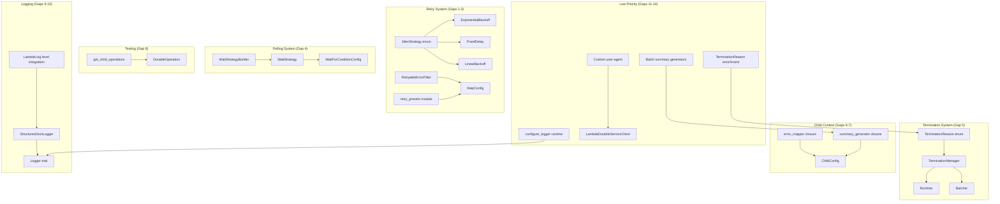
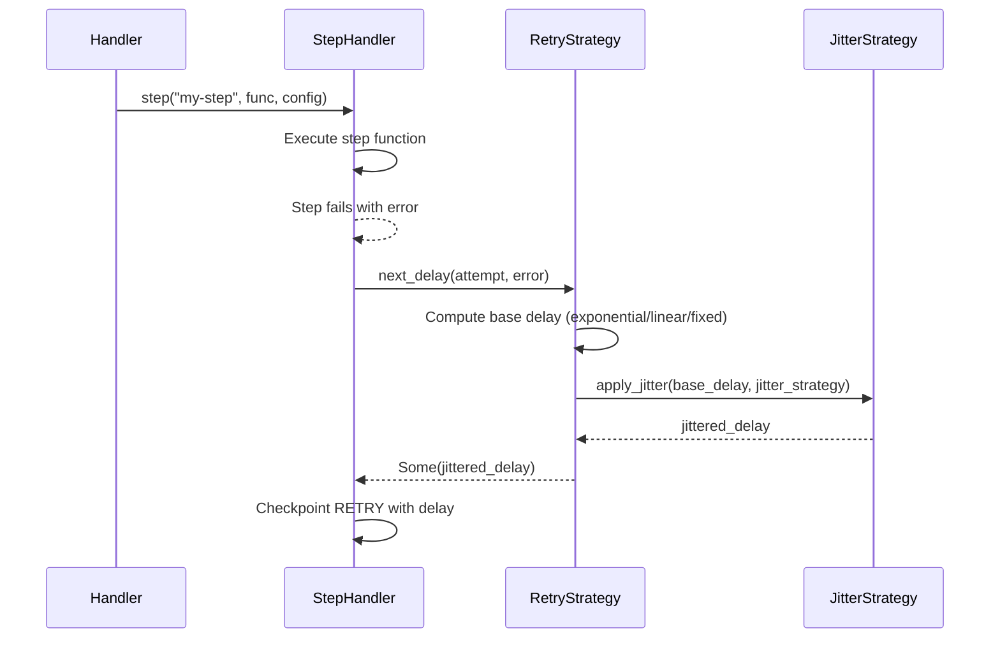
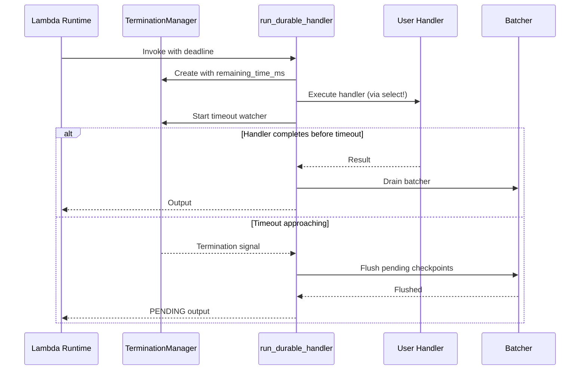
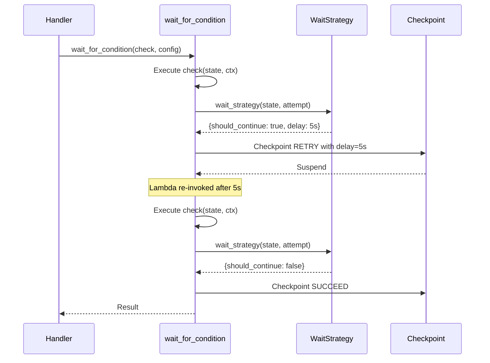

# Design Document: Rust SDK Parity Gaps

## Overview

This design closes the feature parity gaps between the Node.js and Rust durable execution SDKs. The Node.js SDK has matured with features like jitter on retry strategies, typed retryable error filtering, retry presets, a dedicated wait/polling strategy, graceful Lambda timeout detection, child context error mapping and summary generation, structured JSON logging, and richer termination reason tracking. The Rust SDK currently lacks these capabilities.

The changes are organized into three priority tiers. High-priority items (jitter, retryable error filtering, retry presets, wait strategy, graceful termination) address production reliability risks like retry storms and lost checkpoints. Medium-priority items (child context error mapping/summaries, test child enumeration, structured JSON logging, Lambda log level integration) improve developer experience and observability. Low-priority items (termination reasons enum, summary generators for batch ops, runtime logger reconfiguration, custom SDK user-agent) round out API completeness.

All changes are additive and backward-compatible. Existing `RetryStrategy` implementations continue to work. New types compose with existing sealed trait patterns. The design follows Rust idioms: enums over stringly-typed values, builder patterns for configuration, and trait-based extensibility within the sealed boundary.

## Architecture



## Sequence Diagrams

### Retry with Jitter



### Graceful Lambda Timeout Detection



### Wait Strategy with Polling



## Components and Interfaces

### Component 1: JitterStrategy (Gap 1)

**Purpose**: Adds jitter to retry delays to prevent thundering herd problems when many executions retry simultaneously.

```rust
/// Jitter strategy for retry delays.
#[derive(Debug, Clone, Copy, PartialEq, Eq, Default)]
pub enum JitterStrategy {
    /// No jitter — use exact calculated delay.
    #[default]
    None,
    /// Full jitter — random delay in [0, calculated_delay].
    Full,
    /// Half jitter — random delay in [calculated_delay/2, calculated_delay].
    Half,
}

impl JitterStrategy {
    /// Applies jitter to a delay value in seconds.
    /// Uses a deterministic seed derived from attempt number for replay safety.
    pub fn apply(&self, delay_secs: f64, attempt: u32) -> f64;
}
```

**Responsibilities**:
- Compute jittered delay from a base delay
- Use deterministic randomness seeded by attempt number for replay-safe jitter
- Integrate into all existing retry strategies (ExponentialBackoff, FixedDelay, LinearBackoff)

### Component 2: RetryableErrorFilter (Gap 2)

**Purpose**: Declarative error filtering for retry strategies, matching Node.js `retryableErrors` and `retryableErrorTypes` config.

```rust
/// Pattern for matching retryable errors.
#[derive(Clone)]
pub enum ErrorPattern {
    /// Match if error message contains this substring.
    Contains(String),
    /// Match if error message matches this regex.
    Regex(regex::Regex),
}

/// Declarative filter for retryable errors.
#[derive(Clone, Default)]
pub struct RetryableErrorFilter {
    /// Error message patterns (string contains or regex).
    pub patterns: Vec<ErrorPattern>,
    /// Error type names to match against.
    pub error_types: Vec<String>,
}

impl RetryableErrorFilter {
    pub fn is_retryable(&self, error: &str) -> bool;
    pub fn is_retryable_with_type(&self, error: &str, error_type: &str) -> bool;
}
```

**Responsibilities**:
- Filter errors by message substring or regex pattern
- Filter errors by type name string
- Combine patterns and types with OR logic (match either)
- Default to "retry all" when no filters specified

### Component 3: Retry Presets (Gap 3)

**Purpose**: Convenience factory functions for common retry configurations, matching Node.js `retryPresets.default` and `retryPresets.noRetry`.

```rust
/// Pre-configured retry strategies for common use cases.
pub mod retry_presets {
    /// Default retry: 6 attempts, exponential backoff, 5s initial, 60s max, full jitter.
    pub fn default_retry() -> ExponentialBackoff;

    /// No retry: fails immediately on first error.
    pub fn no_retry() -> NoRetry;
}
```

**Responsibilities**:
- Provide zero-config retry strategies matching Node.js defaults
- Reduce boilerplate for common patterns

### Component 4: WaitStrategy (Gap 4)

**Purpose**: Dedicated polling strategy for `wait_for_condition`, replacing the current reuse of `RetryStrategy`. Adds `should_continue_polling` predicate, backoff, and jitter.

```rust
/// Decision returned by a wait strategy.
pub enum WaitDecision {
    /// Continue polling after the specified delay.
    Continue { delay: Duration },
    /// Stop polling — condition is met.
    Done,
}

/// Configuration for creating a wait strategy.
pub struct WaitStrategyConfig<T> {
    pub max_attempts: Option<usize>,
    pub initial_delay: Duration,
    pub max_delay: Duration,
    pub backoff_rate: f64,
    pub jitter: JitterStrategy,
    pub should_continue_polling: Box<dyn Fn(&T) -> bool + Send + Sync>,
}

/// Creates a wait strategy function from config.
pub fn create_wait_strategy<T>(
    config: WaitStrategyConfig<T>,
) -> impl Fn(&T, usize) -> WaitDecision;
```

**Responsibilities**:
- Separate polling concerns from retry concerns
- Support `should_continue_polling` predicate on the result state
- Apply exponential backoff with jitter to polling intervals
- Enforce max attempts with clear error on exhaustion

### Component 5: TerminationManager (Gap 5)

**Purpose**: Proactive Lambda timeout detection. Races the user handler against a timeout signal, flushing checkpoints before Lambda kills the process.

```rust
/// Manages graceful termination before Lambda timeout.
pub struct TerminationManager {
    remaining_time_ms: u64,
    safety_margin_ms: u64,
}

impl TerminationManager {
    /// Creates a new manager from the Lambda context deadline.
    pub fn from_lambda_context(ctx: &lambda_runtime::Context) -> Self;

    /// Returns a future that resolves when the timeout margin is reached.
    pub async fn wait_for_timeout(&self);

    /// Returns the remaining time before the safety margin.
    pub fn remaining_ms(&self) -> u64;
}
```

**Responsibilities**:
- Calculate safe termination deadline from Lambda remaining time minus safety margin
- Provide an async signal that fires before Lambda hard-kills the process
- Integrate with `run_durable_handler` via `tokio::select!` to race handler vs timeout
- Flush batcher and return PENDING on timeout

### Component 6: Child Context Error Mapping (Gap 6)

**Purpose**: Allow users to transform errors from child contexts before propagation.

```rust
// Addition to existing ChildConfig:
pub struct ChildConfig {
    // ... existing fields ...
    /// Optional function to map child context errors before propagation.
    pub error_mapper: Option<Arc<dyn Fn(DurableError) -> DurableError + Send + Sync>>,
}
```

**Responsibilities**:
- Apply user-provided error transformation before propagating child errors
- Pass through errors unchanged when no mapper is configured

### Component 7: Child Context Summary Generation (Gap 7)

**Purpose**: Generate abbreviated payloads when child context results exceed the 256KB checkpoint limit, enabling `ReplayChildren` mode.

```rust
// Addition to existing ChildConfig:
pub struct ChildConfig {
    // ... existing fields ...
    /// Optional function to generate a summary when result exceeds size limit.
    pub summary_generator: Option<Arc<dyn Fn(&str) -> String + Send + Sync>>,
}
```

**Responsibilities**:
- Check serialized result size against 256KB threshold
- Generate summary payload when threshold exceeded
- Store summary instead of full result, enabling replay-based reconstruction

### Component 8: getChildOperations in Testing (Gap 8)

**Purpose**: Allow test code to enumerate child operations of a context operation.

```rust
// Addition to DurableOperation in testing module:
impl DurableOperation {
    /// Returns all child operations nested under this operation.
    pub fn get_child_operations(&self) -> Vec<&DurableOperation>;
}
```

**Responsibilities**:
- Filter operations by parent_id matching this operation's id
- Return ordered list of child operations for test assertions

### Component 9: Structured JSON Logger (Gap 9)

**Purpose**: Built-in logger that emits structured JSON with durable execution metadata, matching Node.js `DefaultLogger` output format.

```rust
/// Structured JSON logger for durable execution.
pub struct StructuredJsonLogger {
    execution_context: Option<JsonLogContext>,
    min_level: LogLevel,
}

/// Context fields included in every JSON log entry.
pub struct JsonLogContext {
    pub request_id: String,
    pub durable_execution_arn: String,
    pub tenant_id: Option<String>,
}

/// A single structured log entry.
#[derive(Serialize)]
struct JsonLogEntry {
    level: String,
    timestamp: String,
    #[serde(rename = "requestId")]
    request_id: String,
    #[serde(rename = "executionArn")]
    execution_arn: String,
    #[serde(skip_serializing_if = "Option::is_none")]
    #[serde(rename = "tenantId")]
    tenant_id: Option<String>,
    #[serde(skip_serializing_if = "Option::is_none")]
    #[serde(rename = "operationId")]
    operation_id: Option<String>,
    #[serde(skip_serializing_if = "Option::is_none")]
    attempt: Option<u32>,
    message: String,
    #[serde(skip_serializing_if = "Option::is_none")]
    #[serde(rename = "errorType")]
    error_type: Option<String>,
    #[serde(skip_serializing_if = "Option::is_none")]
    #[serde(rename = "errorMessage")]
    error_message: Option<String>,
}
```

**Responsibilities**:
- Emit JSON to stdout matching Node.js DefaultLogger format
- Include requestId, executionArn, tenantId, operationId, attempt in every entry
- Respect `AWS_LAMBDA_LOG_LEVEL` environment variable for filtering (Gap 10)

### Component 10: AWS_LAMBDA_LOG_LEVEL Integration (Gap 10)

**Purpose**: Respect Lambda's log level environment variable for filtering, matching Node.js behavior.

Integrated into `StructuredJsonLogger` above. The `min_level` field is initialized from `std::env::var("AWS_LAMBDA_LOG_LEVEL")` at construction time, with fallback to DEBUG.


### Component 11: Enriched TerminationReason (Gap 11)

**Purpose**: Extend the existing `TerminationReason` enum to cover all termination scenarios tracked by the Node.js SDK.

```rust
/// Extended termination reasons matching Node.js SDK parity.
#[derive(Debug, Clone, Copy, PartialEq, Eq, Serialize, Deserialize, Default)]
#[repr(u8)]
pub enum TerminationReason {
    #[default]
    UnhandledError = 0,
    InvocationError = 1,
    ExecutionError = 2,
    CheckpointFailed = 3,
    NonDeterministicExecution = 4,
    StepInterrupted = 5,
    CallbackError = 6,
    SerializationError = 7,
    SizeLimitExceeded = 8,
    // New variants for Node.js parity:
    /// Operation was explicitly terminated.
    OperationTerminated = 9,
    /// A retry has been scheduled; execution will resume.
    RetryScheduled = 10,
    /// A wait operation has been scheduled.
    WaitScheduled = 11,
    /// A callback is pending external completion.
    CallbackPending = 12,
    /// Context validation failed.
    ContextValidationError = 13,
    /// Lambda timeout approaching — graceful shutdown.
    LambdaTimeoutApproaching = 14,
}
```

**Responsibilities**:
- Provide fine-grained termination tracking
- Backward-compatible (existing discriminants unchanged)

### Component 12: Batch Summary Generators (Gap 12)

**Purpose**: Pre-built summary generators for parallel and map operations.

```rust
pub mod summary_generators {
    /// Creates a summary generator for parallel operation results.
    pub fn parallel_summary<T: Serialize>() -> impl Fn(&str) -> String;

    /// Creates a summary generator for map operation results.
    pub fn map_summary<T: Serialize>() -> impl Fn(&str) -> String;
}
```

**Responsibilities**:
- Generate JSON summaries with totalCount, successCount, failureCount, status
- Used with `ChildConfig::summary_generator` for large batch results

### Component 13: Runtime Logger Reconfiguration (Gap 13)

**Purpose**: Allow handler code to reconfigure the logger at runtime.

```rust
impl DurableContext {
    /// Reconfigures the logger for this context.
    pub fn configure_logger(&self, logger: Arc<dyn Logger>);
}
```

**Responsibilities**:
- Swap the logger instance at runtime from handler code
- Thread-safe via `Arc<RwLock<Arc<dyn Logger>>>`

### Component 14: Custom SDK User-Agent (Gap 14)

**Purpose**: Set a custom user-agent on the Lambda client for SDK identification.

```rust
impl LambdaDurableServiceClient {
    /// Creates a client with custom SDK user-agent appended.
    pub fn from_aws_config_with_user_agent(
        config: &aws_config::SdkConfig,
        sdk_name: &str,
        sdk_version: &str,
    ) -> Self;
}
```

**Responsibilities**:
- Append SDK name/version to AWS SDK user-agent header
- Enable service-side tracking of SDK usage

## Data Models

### JitterStrategy Integration into Existing Retry Strategies

```rust
// Updated ExponentialBackoff
pub struct ExponentialBackoff {
    pub max_attempts: u32,
    pub base_delay: Duration,
    pub max_delay: Duration,
    pub multiplier: f64,
    pub jitter: JitterStrategy,           // NEW
}

// Updated ExponentialBackoffBuilder
impl ExponentialBackoffBuilder {
    pub fn jitter(mut self, jitter: JitterStrategy) -> Self;
}

// Updated FixedDelay
pub struct FixedDelay {
    pub max_attempts: u32,
    pub delay: Duration,
    pub jitter: JitterStrategy,           // NEW
}

// Updated LinearBackoff
pub struct LinearBackoff {
    pub max_attempts: u32,
    pub base_delay: Duration,
    pub max_delay: Duration,
    pub jitter: JitterStrategy,           // NEW
}
```

**Validation Rules**:
- `JitterStrategy::None` is the default (backward-compatible)
- Jitter is applied after base delay calculation, before capping at max_delay
- Jittered delay is always >= 1 second

### RetryableErrorFilter Integration into RetryStrategy

```rust
// Updated StepConfig
pub struct StepConfig {
    pub retry_strategy: Option<Box<dyn RetryStrategy>>,
    pub step_semantics: StepSemantics,
    pub serdes: Option<Arc<dyn SerDesAny>>,
    pub retryable_error_filter: Option<RetryableErrorFilter>,  // NEW
}
```

**Validation Rules**:
- When filter is `None`, all errors are retried (current behavior)
- When filter is `Some`, only matching errors trigger retry
- Filter is checked before calling `RetryStrategy::next_delay`

### Updated WaitForConditionConfig

```rust
pub struct WaitForConditionConfig<S> {
    pub initial_state: S,
    pub wait_strategy: Box<dyn Fn(&S, usize) -> WaitDecision + Send + Sync>,  // REPLACES interval + max_attempts
    pub timeout: Option<Duration>,
    pub serdes: Option<Arc<dyn SerDesAny>>,
}
```

**Validation Rules**:
- `wait_strategy` replaces the current `interval` + `max_attempts` fields
- Backward-compatible constructor preserves old behavior
- `timeout` is optional global timeout for the entire polling operation

### Updated ChildConfig

```rust
pub struct ChildConfig {
    pub serdes: Option<Arc<dyn SerDesAny>>,
    pub replay_children: bool,
    pub error_mapper: Option<Arc<dyn Fn(DurableError) -> DurableError + Send + Sync>>,  // NEW
    pub summary_generator: Option<Arc<dyn Fn(&str) -> String + Send + Sync>>,            // NEW
}
```

**Validation Rules**:
- `error_mapper` is applied to errors before propagation from child handler
- `summary_generator` is invoked when serialized result exceeds 256KB
- Both are optional; `None` preserves current behavior

## Algorithmic Pseudocode

### Jitter Application Algorithm

```rust
impl JitterStrategy {
    pub fn apply(&self, delay_secs: f64, attempt: u32) -> f64 {
        match self {
            JitterStrategy::None => delay_secs,
            JitterStrategy::Full => {
                // Deterministic seed from attempt for replay safety
                let seed = deterministic_random(attempt);
                seed * delay_secs  // [0, delay_secs]
            }
            JitterStrategy::Half => {
                let seed = deterministic_random(attempt);
                delay_secs / 2.0 + seed * (delay_secs / 2.0)  // [delay/2, delay]
            }
        }
    }
}
```

**Preconditions:**
- `delay_secs >= 0.0`
- `attempt >= 0`

**Postconditions:**
- `JitterStrategy::None`: result == delay_secs
- `JitterStrategy::Full`: 0.0 <= result <= delay_secs
- `JitterStrategy::Half`: delay_secs/2.0 <= result <= delay_secs
- Result is deterministic for the same (delay_secs, attempt) pair

**Note on Replay Safety:**
Jitter must be deterministic during replay. The Node.js SDK uses `Math.random()` which is non-deterministic, but this is acceptable because jitter only affects the `NextAttemptDelaySeconds` field in the RETRY checkpoint — the service controls the actual re-invocation timing. The Rust SDK can similarly use `rand::thread_rng()` since the jittered delay is written to the checkpoint and the service honors it. The step handler does not re-execute the jitter calculation on replay.

### Retryable Error Filter Algorithm

```rust
impl RetryableErrorFilter {
    pub fn is_retryable(&self, error_msg: &str) -> bool {
        // If no filters configured, retry all
        if self.patterns.is_empty() && self.error_types.is_empty() {
            return true;
        }

        // Check message patterns (OR logic)
        let matches_pattern = self.patterns.iter().any(|p| match p {
            ErrorPattern::Contains(s) => error_msg.contains(s.as_str()),
            ErrorPattern::Regex(r) => r.is_match(error_msg),
        });

        if matches_pattern {
            return true;
        }

        false
    }

    pub fn is_retryable_with_type(&self, error_msg: &str, error_type: &str) -> bool {
        if self.patterns.is_empty() && self.error_types.is_empty() {
            return true;
        }

        // Check type names (OR with patterns)
        let matches_type = self.error_types.iter().any(|t| t == error_type);
        matches_type || self.is_retryable(error_msg)
    }
}
```

**Preconditions:**
- `error_msg` is a valid string (may be empty)

**Postconditions:**
- Returns `true` if no filters are configured (backward-compatible default)
- Returns `true` if error matches any pattern OR any error type
- Returns `false` only when filters are configured and no match found

### Graceful Termination Algorithm

```rust
async fn run_durable_handler_with_termination<E, R, Fut, F>(
    lambda_event: LambdaEvent<DurableExecutionInvocationInput>,
    handler: F,
) -> Result<DurableExecutionInvocationOutput, lambda_runtime::Error>
where
    E: DeserializeOwned,
    R: Serialize,
    Fut: Future<Output = Result<R, DurableError>>,
    F: FnOnce(E, DurableContext) -> Fut,
{
    let (durable_input, lambda_context) = lambda_event.into_parts();

    // Create termination manager from Lambda context
    let termination_mgr = TerminationManager::from_lambda_context(&lambda_context);

    // ... setup state, batcher, context ...

    // Race handler against timeout
    let result = tokio::select! {
        handler_result = handler(user_event, durable_ctx) => {
            // Handler completed normally
            process_result(handler_result, &state, &durable_input.durable_execution_arn).await
        }
        _ = termination_mgr.wait_for_timeout() => {
            // Timeout approaching — flush and return PENDING
            state.flush_batcher().await;
            DurableExecutionInvocationOutput::pending()
        }
    };

    // Cleanup
    drop(state);
    let _ = tokio::time::timeout(
        std::time::Duration::from_secs(BATCHER_DRAIN_TIMEOUT_SECS),
        batcher_handle,
    ).await;

    Ok(result)
}
```

**Preconditions:**
- Lambda context contains a valid deadline
- Safety margin (default 5s) is less than remaining Lambda time

**Postconditions:**
- If handler completes before timeout: normal result processing
- If timeout fires first: batcher is flushed, PENDING returned
- No checkpoint data is lost on timeout

### Wait Strategy Algorithm

```rust
pub fn create_wait_strategy<T: Send + Sync + 'static>(
    config: WaitStrategyConfig<T>,
) -> Box<dyn Fn(&T, usize) -> WaitDecision + Send + Sync> {
    let max_attempts = config.max_attempts.unwrap_or(60);
    let initial_delay_secs = config.initial_delay.to_seconds() as f64;
    let max_delay_secs = config.max_delay.to_seconds() as f64;
    let backoff_rate = config.backoff_rate;
    let jitter = config.jitter;
    let should_continue = config.should_continue_polling;

    Box::new(move |result: &T, attempts_made: usize| -> WaitDecision {
        // Check if condition is met
        if !should_continue(result) {
            return WaitDecision::Done;
        }

        // Check max attempts
        if attempts_made >= max_attempts {
            panic!("waitForCondition exceeded maximum attempts ({})", max_attempts);
        }

        // Calculate delay with exponential backoff
        let base_delay = (initial_delay_secs * backoff_rate.powi(attempts_made as i32 - 1))
            .min(max_delay_secs);

        // Apply jitter
        let jittered = jitter.apply(base_delay, attempts_made as u32);
        let final_delay = jittered.max(1.0).round() as u64;

        WaitDecision::Continue {
            delay: Duration::from_seconds(final_delay),
        }
    })
}
```

**Preconditions:**
- `config.initial_delay > 0`
- `config.backoff_rate >= 1.0`

**Postconditions:**
- Returns `Done` when `should_continue_polling` returns false
- Returns `Continue` with delay >= 1 second
- Delay grows exponentially up to `max_delay`
- Panics when `max_attempts` exceeded (matching Node.js throw behavior)

**Loop Invariants:**
- `attempts_made` monotonically increases across invocations
- Delay is always bounded by [1, max_delay_secs]

## Key Functions with Formal Specifications

### Function: ExponentialBackoff::next_delay (updated with jitter)

```rust
fn next_delay(&self, attempt: u32, error: &str) -> Option<Duration>
```

**Preconditions:**
- `self.base_delay > 0`
- `self.max_delay >= self.base_delay`
- `self.multiplier > 0.0`

**Postconditions:**
- Returns `None` when `attempt >= self.max_attempts`
- Returns `Some(d)` where `d >= 1 second`
- When `self.jitter == None`: `d == min(base * multiplier^attempt, max_delay)`
- When `self.jitter == Full`: `0 <= d <= min(base * multiplier^attempt, max_delay)`
- When `self.jitter == Half`: `d/2 <= d <= min(base * multiplier^attempt, max_delay)`

### Function: TerminationManager::from_lambda_context

```rust
pub fn from_lambda_context(ctx: &lambda_runtime::Context) -> Self
```

**Preconditions:**
- `ctx.deadline` is a valid future timestamp

**Postconditions:**
- `self.remaining_time_ms` = deadline - now (in ms)
- `self.safety_margin_ms` = 5000 (default)
- `self.remaining_time_ms > self.safety_margin_ms` (otherwise immediate termination)

### Function: ChildConfig error_mapper application

```rust
// In child_handler, after catching an error:
let mapped_error = match &config.error_mapper {
    Some(mapper) => mapper(error),
    None => error,
};
```

**Preconditions:**
- `error` is a valid `DurableError`

**Postconditions:**
- When `error_mapper` is `None`: error passes through unchanged
- When `error_mapper` is `Some(f)`: `f(error)` is returned
- The mapped error is what gets checkpointed and propagated

### Function: StructuredJsonLogger level filtering

```rust
fn should_log(&self, level: LogLevel) -> bool
```

**Preconditions:**
- `self.min_level` is initialized from `AWS_LAMBDA_LOG_LEVEL` or defaults to `Debug`

**Postconditions:**
- Returns `true` when `level.priority() >= self.min_level.priority()`
- Priority order: Debug(2) < Info(3) < Warn(4) < Error(5)

## Example Usage

### Jitter on Retry Strategies

```rust
use aws_durable_execution_sdk::config::{ExponentialBackoff, JitterStrategy};
use aws_durable_execution_sdk::Duration;

// Exponential backoff with full jitter (recommended for production)
let strategy = ExponentialBackoff::builder()
    .max_attempts(5)
    .base_delay(Duration::from_seconds(5))
    .max_delay(Duration::from_seconds(60))
    .jitter(JitterStrategy::Full)
    .build();

// Fixed delay with half jitter
let fixed = FixedDelay::new(3, Duration::from_seconds(10))
    .with_jitter(JitterStrategy::Half);
```

### Retryable Error Filtering

```rust
use aws_durable_execution_sdk::config::{RetryableErrorFilter, ErrorPattern};

let filter = RetryableErrorFilter {
    patterns: vec![
        ErrorPattern::Contains("timeout".to_string()),
        ErrorPattern::Regex(regex::Regex::new(r"(?i)connection.*refused").unwrap()),
    ],
    error_types: vec!["TransientError".to_string()],
};

let config = StepConfig {
    retry_strategy: Some(Box::new(retry_presets::default_retry())),
    retryable_error_filter: Some(filter),
    ..Default::default()
};
```

### Retry Presets

```rust
use aws_durable_execution_sdk::config::retry_presets;

// Default: 6 attempts, exponential, full jitter
let result = ctx.step(
    |_| Ok(call_api()),
    Some(StepConfig {
        retry_strategy: Some(Box::new(retry_presets::default_retry())),
        ..Default::default()
    }),
).await?;

// No retry
let result = ctx.step(
    |_| Ok(critical_operation()),
    Some(StepConfig {
        retry_strategy: Some(Box::new(retry_presets::no_retry())),
        ..Default::default()
    }),
).await?;
```

### Wait Strategy with Polling

```rust
use aws_durable_execution_sdk::config::{create_wait_strategy, WaitStrategyConfig, JitterStrategy};

let wait_strategy = create_wait_strategy(WaitStrategyConfig {
    max_attempts: Some(30),
    initial_delay: Duration::from_seconds(5),
    max_delay: Duration::from_seconds(300),
    backoff_rate: 1.5,
    jitter: JitterStrategy::Full,
    should_continue_polling: Box::new(|state: &OrderStatus| {
        state.status != "COMPLETED" && state.status != "FAILED"
    }),
});

let result = ctx.wait_for_condition(
    |state, _ctx| {
        let updated = check_order_status(state.order_id)?;
        Ok(updated)
    },
    WaitForConditionConfig {
        initial_state: OrderStatus { order_id: "ORD-123".into(), status: "PENDING".into() },
        wait_strategy: Box::new(wait_strategy),
        timeout: None,
        serdes: None,
    },
).await?;
```

### Child Context with Error Mapping and Summary

```rust
use aws_durable_execution_sdk::ChildConfig;

let config = ChildConfig {
    error_mapper: Some(Arc::new(|err| {
        // Map internal errors to user-friendly errors
        DurableError::execution(format!("Payment processing failed: {}", err))
    })),
    summary_generator: Some(Arc::new(|serialized_result| {
        // Generate compact summary for large results
        let parsed: serde_json::Value = serde_json::from_str(serialized_result).unwrap();
        serde_json::json!({
            "type": "PaymentResult",
            "status": parsed["status"],
            "amount": parsed["amount"],
        }).to_string()
    })),
    ..Default::default()
};
```

### Structured JSON Logger

```rust
use aws_durable_execution_sdk::context::StructuredJsonLogger;

// Logger automatically reads AWS_LAMBDA_LOG_LEVEL
let logger = StructuredJsonLogger::new();

// Output example:
// {"level":"INFO","timestamp":"2024-01-15T10:30:00.000Z","requestId":"abc-123",
//  "executionArn":"arn:aws:...","operationId":"op-456","message":"Step completed"}
```

## Correctness Properties

1. **Jitter bounds**: ∀ strategy, delay, attempt: `JitterStrategy::None.apply(d, a) == d` ∧ `0 ≤ JitterStrategy::Full.apply(d, a) ≤ d` ∧ `d/2 ≤ JitterStrategy::Half.apply(d, a) ≤ d`
2. **Retry filter default**: ∀ error: `RetryableErrorFilter::default().is_retryable(error) == true`
3. **Retry filter specificity**: When patterns are configured, only matching errors return `true`
4. **Preset equivalence**: `retry_presets::default_retry()` produces same delay sequence as Node.js `retryPresets.default` (modulo jitter randomness)
5. **Wait strategy termination**: `create_wait_strategy` with `max_attempts = N` will return `Done` or panic after at most N calls
6. **Termination safety**: When `TerminationManager` fires, all pending checkpoint batches are flushed before returning PENDING
7. **Error mapper transparency**: When `error_mapper` is `None`, child errors propagate identically to current behavior
8. **Summary threshold**: `summary_generator` is only invoked when serialized result exceeds 256KB
9. **Log level filtering**: `StructuredJsonLogger` with `min_level = Warn` emits only Warn and Error messages
10. **Backward compatibility**: All existing public APIs continue to work without modification; new fields have defaults matching current behavior

## Error Handling

### Error Scenario 1: Jitter with Zero Delay

**Condition**: `base_delay` is 0 seconds
**Response**: Jitter returns 0 regardless of strategy (no division issues)
**Recovery**: N/A — this is valid behavior

### Error Scenario 2: Regex Compilation Failure in ErrorPattern

**Condition**: User provides invalid regex string
**Response**: `regex::Regex::new()` returns `Err` at construction time
**Recovery**: User fixes regex before passing to `ErrorPattern::Regex`. The `Regex` type ensures only valid patterns are stored.

### Error Scenario 3: Lambda Timeout with No Remaining Time

**Condition**: Lambda context deadline is already past or within safety margin
**Response**: `TerminationManager` fires immediately
**Recovery**: Handler never executes; PENDING returned immediately. Next invocation gets fresh time budget.

### Error Scenario 4: Summary Generator Panics

**Condition**: User-provided `summary_generator` closure panics
**Response**: Panic propagates as `DurableError::UserCode`
**Recovery**: User fixes summary generator. Original unsummarized result is not lost (still in memory).

### Error Scenario 5: Error Mapper Produces Suspend

**Condition**: `error_mapper` returns `DurableError::Suspend`
**Response**: Suspend is treated as a suspend signal, not checkpointed as failure
**Recovery**: This is valid — allows error mapper to convert errors into suspend signals

## Testing Strategy

### Unit Testing Approach

- Test each `JitterStrategy` variant with known seeds to verify bounds
- Test `RetryableErrorFilter` with various pattern/type combinations
- Test `retry_presets` produce expected delay sequences
- Test `WaitDecision` logic with mock `should_continue_polling`
- Test `TerminationManager` timing with mock Lambda contexts
- Test `ChildConfig` error_mapper and summary_generator integration
- Test `StructuredJsonLogger` output format and level filtering
- Test `TerminationReason` new variants serialize/deserialize correctly

### Property-Based Testing Approach

**Property Test Library**: proptest

- Jitter bounds: For any delay ≥ 0 and any attempt, jittered delay is within expected range
- Error filter: Empty filter always returns true; non-empty filter returns true iff match exists
- Wait strategy: For any sequence of states, Done is returned iff `should_continue_polling` returns false
- Retry preset delays: All delays are ≥ 1 second and ≤ max_delay
- JSON logger: All emitted entries are valid JSON with required fields

### Integration Testing Approach

- End-to-end test: step with jittered retry strategy completes successfully after transient failures
- End-to-end test: wait_for_condition with WaitStrategy polls and terminates correctly
- End-to-end test: graceful termination flushes checkpoints before Lambda timeout
- End-to-end test: child context with error_mapper transforms errors correctly
- End-to-end test: structured JSON logger output is parseable and contains expected metadata

## Performance Considerations

- Jitter computation is O(1) per retry attempt — negligible overhead
- `RetryableErrorFilter` with regex patterns: regex compilation happens once at construction; matching is O(n) per pattern per error. Keep pattern count small.
- `TerminationManager` uses a single `tokio::time::sleep` — no polling overhead
- `StructuredJsonLogger` serializes to JSON on each log call. For hot paths, consider using the existing `TracingLogger` with a JSON tracing subscriber instead.
- Summary generators are only invoked when results exceed 256KB — no overhead for normal-sized results

## Security Considerations

- `RetryableErrorFilter` regex patterns should be validated at construction to prevent ReDoS. Consider using `regex::Regex` which has built-in protection against catastrophic backtracking.
- `StructuredJsonLogger` must sanitize or escape user-provided message content to prevent log injection attacks.
- Error mapper closures run user code — errors from the mapper itself should be caught and wrapped, not allowed to crash the runtime.

## Dependencies

- `regex` crate — for `ErrorPattern::Regex` support (already a transitive dependency via other crates)
- `rand` crate — for jitter randomness (or use deterministic approach with existing blake2b)
- `chrono` or `time` crate — for ISO 8601 timestamps in structured JSON logger (or use `std::time`)
- No new external service dependencies
- All changes are within the `aws-durable-execution-sdk/sdk` crate
