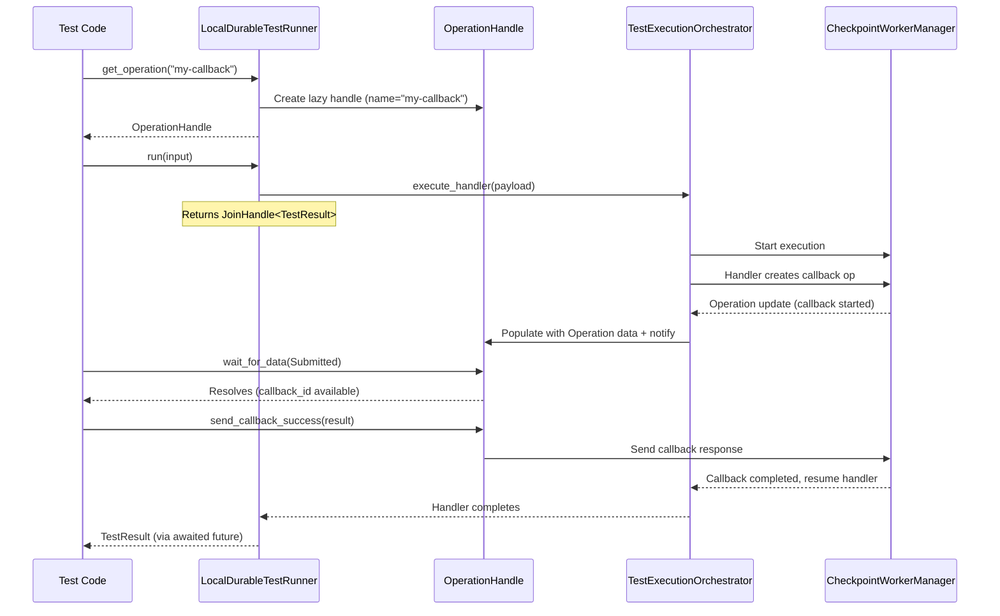

# Design Document: Rust SDK Testing Parity

## Overview

This design closes the testing utility gaps between the Rust SDK testing crate (`aws-durable-execution-sdk-testing`) and the Node.js SDK testing package (`@aws/durable-execution-sdk-js-testing`). The core gap is the inability to write idiomatic callback interaction tests in Rust — specifically, the pattern of pre-registering an operation handle before `run()`, starting a non-blocking execution, waiting for mid-execution status changes, sending callback responses, and awaiting the final result.

The current Rust API requires `run()` to complete (or suspend) before any operation inspection. This makes it impossible to interact with callbacks mid-execution. The Node.js SDK solves this with lazy operation handles that auto-populate during execution and a non-blocking `run()` that returns a promise.

This design introduces:
1. An `OperationHandle` — a lazy, shared reference to a named operation that is registered before `run()` and auto-populates with operation data during execution
2. A non-blocking `run()` that returns a future for concurrent interaction
3. Child operation enumeration on `DurableOperation`
4. `wait_for_data(status)` integration with `WaitingOperationStatus`
5. `reset()` for clean state between test runs
6. Function registration for invoke operations
7. Ergonomic `TestResult` accessors
8. An `InvokeRequest` input wrapper

### Key Design Decision: OperationHandle as the Central Abstraction

The `OperationHandle` is the linchpin of this design. It bridges the gap between "I want to reference an operation before it exists" and "I need to interact with it once it does." In Rust, this requires interior mutability and async signaling — we use `Arc<RwLock<Option<Operation>>>` for the data and `tokio::sync::watch` channels for status notifications.

## Architecture



### Component Interaction

The architecture extends the existing `LocalDurableTestRunner` → `TestExecutionOrchestrator` → `CheckpointWorkerManager` pipeline. The new `OperationHandle` sits between the test code and the orchestrator, receiving operation updates via `tokio::sync::watch` channels.

Key architectural decisions:
- **OperationHandle uses `Arc` internally** so it can be cloned and shared between the test code and the orchestrator without lifetime issues
- **The orchestrator notifies handles** during its polling loop when operations are created or updated, rather than handles polling the orchestrator
- **`run()` spawns a tokio task** and returns a `RunFuture` that wraps the `JoinHandle`, allowing concurrent `await` on both the run result and operation handles

## Components and Interfaces

### 1. OperationHandle

A lazy reference to a named operation, registered before `run()` and auto-populated during execution.

```rust
/// A lazy handle to an operation that will be populated during execution.
/// Registered before run() via get_operation(), get_operation_by_index(), 
/// or get_operation_by_id().
#[derive(Clone)]
pub struct OperationHandle {
    /// How this handle matches operations
    matcher: OperationMatcher,
    /// Shared operation data, populated during execution
    inner: Arc<RwLock<Option<Operation>>>,
    /// Watch channel for status notifications
    status_tx: watch::Sender<Option<OperationStatus>>,
    status_rx: watch::Receiver<Option<OperationStatus>>,
    /// Callback sender for interacting with the checkpoint server
    callback_sender: Option<Arc<dyn CallbackSender>>,
    /// Shared reference to all operations (for child enumeration)
    all_operations: Arc<RwLock<Vec<Operation>>>,
}

/// How an OperationHandle matches against operations during execution.
#[derive(Clone, Debug)]
enum OperationMatcher {
    ByName(String),
    ByIndex(usize),
    ById(String),
}
```

Public API:
```rust
impl OperationHandle {
    // Inspection methods (delegate to inner DurableOperation when populated)
    pub async fn get_id(&self) -> Result<String, TestError>;
    pub async fn get_name(&self) -> Result<Option<String>, TestError>;
    pub async fn get_type(&self) -> Result<OperationType, TestError>;
    pub async fn get_status(&self) -> Result<OperationStatus, TestError>;
    pub async fn get_step_details<T: DeserializeOwned>(&self) -> Result<StepDetails<T>, TestError>;
    pub async fn get_callback_details<T: DeserializeOwned>(&self) -> Result<CallbackDetails<T>, TestError>;
    pub async fn get_wait_details(&self) -> Result<WaitDetails, TestError>;
    pub async fn get_invoke_details<T: DeserializeOwned>(&self) -> Result<InvokeDetails<T>, TestError>;
    pub async fn get_context_details<T: DeserializeOwned>(&self) -> Result<ContextDetails<T>, TestError>;

    // Async waiting
    pub async fn wait_for_data(&self, status: WaitingOperationStatus) -> Result<(), TestError>;

    // Callback interaction
    pub async fn send_callback_success(&self, result: &str) -> Result<(), TestError>;
    pub async fn send_callback_failure(&self, error: &TestResultError) -> Result<(), TestError>;
    pub async fn send_callback_heartbeat(&self) -> Result<(), TestError>;

    // Child enumeration
    pub async fn get_child_operations(&self) -> Result<Vec<DurableOperation>, TestError>;

    // Check if populated
    pub async fn is_populated(&self) -> bool;
}
```

### 2. LocalDurableTestRunner Extensions

New methods on the existing `LocalDurableTestRunner`:

```rust
impl<I, O> LocalDurableTestRunner<I, O> {
    // --- Pre-run operation registration (Requirement 1) ---
    /// Returns a lazy OperationHandle that populates when an operation 
    /// matching the name is created during execution.
    pub fn get_operation_handle(&mut self, name: &str) -> OperationHandle;
    
    /// Returns a lazy OperationHandle that populates by execution order index.
    pub fn get_operation_handle_by_index(&mut self, index: usize) -> OperationHandle;
    
    /// Returns a lazy OperationHandle that populates by operation ID.
    pub fn get_operation_handle_by_id(&mut self, id: &str) -> OperationHandle;

    // --- Non-blocking run (Requirement 2) ---
    // The existing run() signature changes to return a future that can be 
    // awaited concurrently. Internally spawns a tokio task.
    // pub async fn run(&mut self, payload: I) -> Result<TestResult<O>, TestError>
    // remains the same signature but now supports concurrent handle interaction.

    // --- Function registration (Requirement 7) ---
    // Already exists: register_durable_function, register_function, clear_registered_functions

    // --- Reset (Requirement 6) ---
    // Already exists: reset()
    // Extended to also clear pre-registered OperationHandles
}
```

### 3. DurableOperation Extensions

New method on the existing `DurableOperation`:

```rust
impl DurableOperation {
    // Already exists: get_child_operations()
    // Already exists: wait_for_data(status)
    // Already exists: send_callback_success/failure/heartbeat
    // No new methods needed — the existing API already covers Requirements 3, 4
}
```

### 4. TestResult Extensions

```rust
impl<T> TestResult<T> {
    // Already exists: get_result(), get_error()
    // These already return Result types with appropriate errors.
    // No changes needed — the existing API satisfies Requirement 8.
}
```

### 5. InvokeRequest

```rust
/// Structured input wrapper for run(), matching the Node.js SDK's InvokeRequest.
#[derive(Debug, Clone, Default, Serialize, Deserialize)]
pub struct InvokeRequest<T = serde_json::Value> {
    /// Optional payload to pass to the handler
    pub payload: Option<T>,
}

impl<T> InvokeRequest<T> {
    pub fn new() -> Self { Self { payload: None } }
    pub fn with_payload(payload: T) -> Self { Self { payload: Some(payload) } }
}
```

`run()` will accept `impl Into<InvokeRequest<I>>` so both raw payloads and `InvokeRequest` structs work.

### 6. RunFuture

```rust
/// A future returned by run() that resolves to TestResult.
/// Can be awaited concurrently with OperationHandle interactions.
pub struct RunFuture<O> {
    handle: tokio::task::JoinHandle<Result<TestResult<O>, TestError>>,
}

impl<O> Future for RunFuture<O> {
    type Output = Result<TestResult<O>, TestError>;
    // Delegates to JoinHandle
}
```

## Data Models

### OperationHandle Internal State

```
OperationHandle
├── matcher: OperationMatcher (ByName | ByIndex | ById)
├── inner: Arc<RwLock<Option<Operation>>>     // populated during execution
├── status_tx/rx: watch channel               // None → Some(status) notifications
├── callback_sender: Option<Arc<dyn CallbackSender>>
└── all_operations: Arc<RwLock<Vec<Operation>>> // shared with orchestrator
```

### Handle Registry in LocalDurableTestRunner

```
LocalDurableTestRunner
├── ... (existing fields)
├── registered_handles: Vec<OperationHandle>   // pre-registered before run()
└── shared_operations: Arc<RwLock<Vec<Operation>>> // shared with handles
```

### InvokeRequest

```
InvokeRequest<T>
└── payload: Option<T>
```

### Operation Population Flow

1. Test calls `runner.get_operation_handle("my-callback")` → handle stored in `registered_handles`
2. Test calls `runner.run(input)` → orchestrator starts, receives `registered_handles`
3. Orchestrator polls checkpoint server for operation updates
4. When an operation matching a handle's matcher is found, orchestrator:
   - Writes the `Operation` into the handle's `inner: Arc<RwLock<Option<Operation>>>`
   - Sends the operation's status via `status_tx`
5. Handle's `wait_for_data()` watches `status_rx` for the target status
6. Handle's `send_callback_success()` uses `callback_sender` to send to checkpoint server

### Error Cases

| Scenario | Error |
|----------|-------|
| Inspection on unpopulated handle | `TestError::OperationNotFound("Operation not yet populated")` |
| `run()` completes, no matching operation | `TestError::OperationNotFound("No operation matched...")` |
| `send_callback_success` on non-callback | `TestError::NotCallbackOperation` |
| `send_callback_success` before Submitted | `TestError::ResultNotAvailable("Callback not ready")` |
| `wait_for_data` after execution completes | `TestError::ExecutionCompletedEarly(...)` |


## Correctness Properties

*A property is a characteristic or behavior that should hold true across all valid executions of a system — essentially, a formal statement about what the system should do. Properties serve as the bridge between human-readable specifications and machine-verifiable correctness guarantees.*

### Property 1: Unpopulated handles error on inspection

*For any* `OperationHandle` that has not been populated (either because `run()` hasn't been called yet, or because no operation matched the handle's matcher), calling any inspection method (`get_id`, `get_name`, `get_type`, `get_status`, `get_step_details`, etc.) SHALL return `Err(TestError::OperationNotFound(...))`.

**Validates: Requirements 1.1, 1.6**

### Property 2: Handle population matches correctly

*For any* set of operations produced by a handler execution, and *for any* `OperationHandle` registered with a matcher (by name, by index, or by ID), the handle SHALL be populated with the operation that matches the matcher criteria — the first operation with that name, the operation at that index, or the operation with that ID respectively. If no operation matches, the handle SHALL remain unpopulated.

**Validates: Requirements 1.2, 1.7, 1.8**

### Property 3: Populated handle delegates to DurableOperation

*For any* populated `OperationHandle`, calling an inspection method SHALL return the same result as calling the corresponding method on a `DurableOperation` constructed from the same `Operation` data. Specifically, `get_id()`, `get_name()`, `get_type()`, `get_status()`, and type-specific detail methods SHALL produce equivalent results.

**Validates: Requirements 1.3, 1.4, 1.5**

### Property 4: Child operations filtered by parent_id and ordered

*For any* set of operations where some have `parent_id` set, calling `get_child_operations()` on an operation SHALL return exactly those operations whose `parent_id` equals the caller's `operation_id`, in the same order they appear in the all-operations list. If no operations have a matching `parent_id`, the result SHALL be an empty list.

**Validates: Requirements 3.1, 3.2, 3.4**

### Property 5: Recursive child enumeration

*For any* operation tree of depth N, calling `get_child_operations()` on a parent, then calling `get_child_operations()` on each child, SHALL correctly enumerate grandchildren at each level, with each child supporting the full `DurableOperation` inspection API.

**Validates: Requirements 3.3**

### Property 6: wait_for_data resolves immediately for reached statuses

*For any* `DurableOperation` or `OperationHandle` whose operation has already reached status S (Started, Submitted with callback_id for callbacks, or Completed for terminal statuses), calling `wait_for_data(S)` SHALL resolve immediately without blocking.

**Validates: Requirements 4.1, 4.2, 4.3, 4.5**

### Property 7: Callback testing pattern round-trip

*For any* handler that creates a callback operation and waits for its result, pre-registering a handle, starting `run()`, waiting for `Submitted` status, and sending a callback response (success or failure) SHALL cause the handler to complete with the sent response incorporated into the final `TestResult`.

**Validates: Requirements 2.3, 2.4, 2.5, 5.1, 5.2**

### Property 8: Multiple concurrent callbacks are independent

*For any* handler that creates N callback operations concurrently, pre-registering N handles and sending independent responses to each SHALL result in each callback receiving its own response, with no cross-contamination between callbacks.

**Validates: Requirements 5.3**

### Property 9: Premature callback send errors

*For any* `OperationHandle` for a callback operation that has not yet reached `Submitted` status (callback_id not available), calling `send_callback_success()` or `send_callback_failure()` SHALL return an error.

**Validates: Requirements 5.4**

### Property 10: Execution-completed-early error

*For any* `OperationHandle` where `wait_for_data(status)` is called and the execution completes before the operation reaches the requested status, the `wait_for_data` call SHALL return `Err(TestError::ExecutionCompletedEarly(...))`.

**Validates: Requirements 2.6**

### Property 11: Reset produces clean state

*For any* `LocalDurableTestRunner` that has completed a `run()` with operations and registered handles, calling `reset()` and then `run()` again SHALL produce results equivalent to a freshly constructed runner — zero pre-existing operations, no stale handles, and clean checkpoint server state.

**Validates: Requirements 6.1, 6.2, 6.3, 6.4**

### Property 12: Function registration round-trip

*For any* function name and handler, calling `register_durable_function(name, handler)` or `register_function(name, handler)` SHALL cause `has_registered_function(name)` to return `true`, and `clear_registered_functions()` SHALL cause it to return `false` for all previously registered names.

**Validates: Requirements 7.1, 7.2, 7.5**

### Property 13: TestResult accessor consistency

*For any* `TestResult<T>`, `get_result()` SHALL return `Ok(&T)` if and only if the status is `Succeeded`, and `get_error()` SHALL return `Ok(&TestResultError)` if and only if the status is `Failed`. The two accessors SHALL be mutually exclusive — exactly one succeeds for any terminal result.

**Validates: Requirements 8.1, 8.2, 8.3, 8.4**

### Property 14: InvokeRequest payload round-trip

*For any* serializable payload `T`, calling `run(InvokeRequest::with_payload(value))` SHALL pass `value` to the handler function, and the handler SHALL receive the same deserialized value. Calling `run(InvokeRequest::new())` (no payload) SHALL pass a default empty value.

**Validates: Requirements 9.1, 9.2, 9.3**

## Error Handling

### Error Categories

| Category | Error Type | Recovery |
|----------|-----------|----------|
| Unpopulated handle access | `TestError::OperationNotFound` | Wait for population or check `is_populated()` |
| Type mismatch on details | `TestError::OperationTypeMismatch` | Check `get_type()` before calling type-specific methods |
| Callback on non-callback op | `TestError::NotCallbackOperation` | Check `is_callback()` before sending |
| Premature callback send | `TestError::ResultNotAvailable` | Use `wait_for_data(Submitted)` first |
| Execution completed early | `TestError::ExecutionCompletedEarly` | Handler completed before operation reached target status |
| Unregistered function invoke | `TestError::FunctionNotRegistered` | Register function before running handler |
| Serialization failure | `TestError::SerializationError` | Fix payload/result types |
| Checkpoint server error | `TestError::CheckpointServerError` | Internal error, check test setup |

### Error Propagation Strategy

- `OperationHandle` methods return `Result<T, TestError>` — never panic
- `run()` propagates handler errors as `TestResult` with `Failed` status, infrastructure errors as `Err(TestError)`
- `wait_for_data()` returns `Err` if the watch channel closes (execution ended) before target status
- Callback methods validate preconditions (is_callback, has callback_id) before delegating to `CallbackSender`

### Graceful Degradation

- If the checkpoint server is unreachable during callback send, return `TestError::CheckpointCommunicationError`
- If `reset()` fails to re-acquire the checkpoint worker, panic (unrecoverable test infrastructure failure)
- If a handle's watch channel is dropped (orchestrator finished), `wait_for_data` returns the appropriate error rather than hanging

## Testing Strategy

### Dual Testing Approach

This feature requires both unit tests and property-based tests for comprehensive coverage.

### Unit Tests

Unit tests focus on specific examples, edge cases, and integration points:

- `OperationHandle` creation with each matcher type (ByName, ByIndex, ById)
- `OperationHandle` population with a known operation
- `OperationHandle` error on unpopulated access
- `InvokeRequest` construction with and without payload
- `InvokeRequest` default payload behavior
- `reset()` clears handles and operations
- End-to-end callback pattern with a simple handler (the "golden path" integration test)
- Multiple concurrent callbacks integration test
- `wait_for_data` with already-reached status (immediate resolution)
- `wait_for_data` with execution-completed-early error

### Property-Based Tests

Property-based tests use the `proptest` crate (already a dev-dependency) with minimum 100 iterations per property. Each test references its design document property.

| Property | Test Strategy | Generator |
|----------|--------------|-----------|
| Property 1: Unpopulated handle errors | Generate random matcher types, verify all inspection methods error | Random strings for names, random usize for indices, random UUIDs for IDs |
| Property 2: Handle population matching | Generate random operation lists and matchers, verify correct matching | Random Vec<Operation> with random names/IDs, random matchers |
| Property 3: Populated handle delegation | Generate random operations, populate handles, compare with DurableOperation | Random Operation with type-appropriate details |
| Property 4: Child operations filtering | Generate random operation trees with parent_id relationships, verify filtering | Random tree structures with 0-5 children per node |
| Property 5: Recursive child enumeration | Generate random operation trees of depth 1-3, verify recursive enumeration | Random tree structures with depth parameter |
| Property 6: wait_for_data immediate resolution | Generate random operations with various statuses, verify immediate resolution | Random OperationStatus × WaitingOperationStatus combinations |
| Property 11: Reset clean state | Generate random pre-run state, reset, verify clean | Random registered handles and operations |
| Property 12: Function registration round-trip | Generate random function names, register, verify, clear, verify | Random strings for function names |
| Property 13: TestResult accessor consistency | Generate random TestResults (success/failure), verify accessor behavior | Random result values and error types |
| Property 14: InvokeRequest payload round-trip | Generate random payloads, wrap in InvokeRequest, verify handler receives same | Random JSON values |

Properties 7, 8, 9, 10 require integration-level tests with actual handler execution and are tested as async integration tests with proptest-generated inputs (callback result strings, error types, number of concurrent callbacks).

### Test Configuration

- Property-based testing library: `proptest` (already in dev-dependencies)
- Minimum iterations: 100 per property test (`ProptestConfig::with_cases(100)`)
- Each property test tagged with: `// Feature: rust-sdk-testing-parity, Property {N}: {title}`
- Integration tests in `aws-durable-execution-sdk/testing/tests/` and `aws-durable-execution-sdk/examples/tests/`
- Unit tests in `#[cfg(test)] mod tests` within each modified source file
