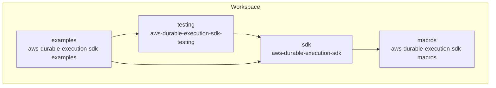
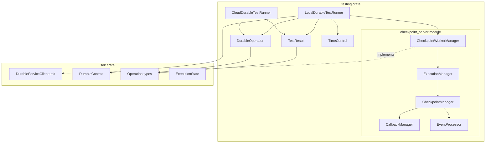
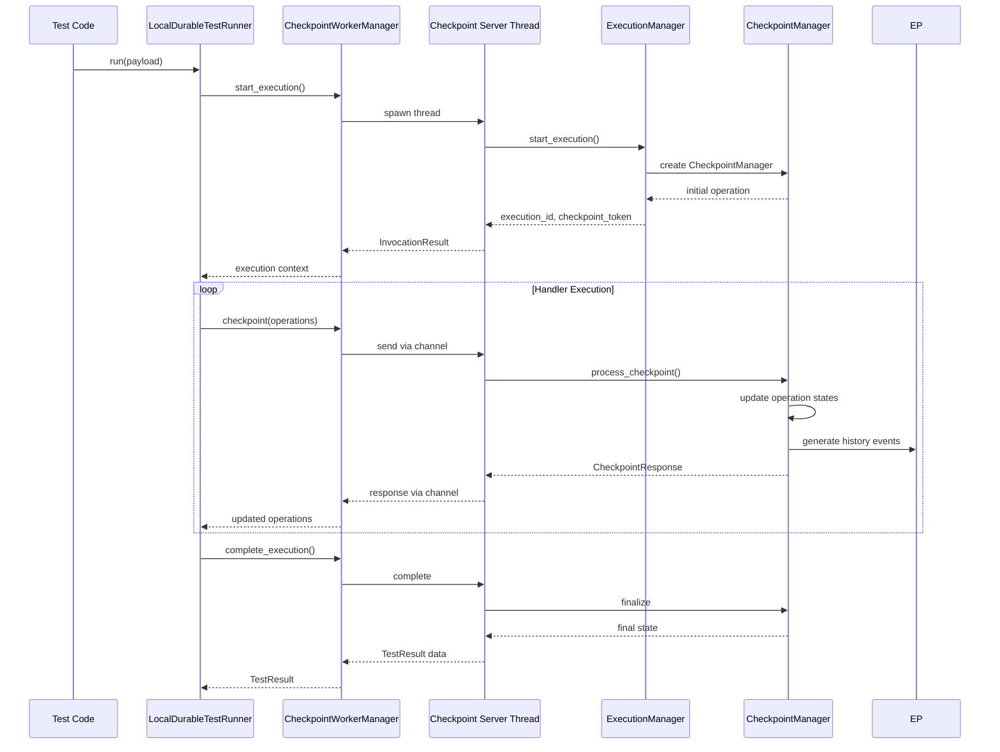
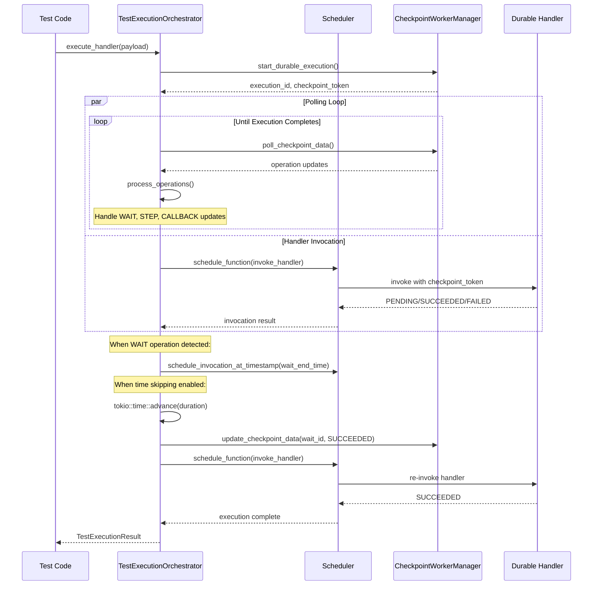

# Design Document: Rust Durable Execution SDK Testing Utilities

## Overview

This document describes the design for a testing utilities crate (`aws-durable-execution-sdk-testing`) for the AWS Durable Execution SDK for Rust. The crate provides developers with tools to test durable functions locally and against deployed AWS Lambda functions, enabling rapid development iteration and comprehensive integration testing.

**IMPORTANT**: This design follows the same architectural approach as the Node.js SDK (`@aws/durable-execution-sdk-js-testing`), using a worker thread-based checkpoint server with full execution state management. This ensures consistent behavior across SDKs and provides realistic testing capabilities.

The design follows Rust idioms and leverages the existing SDK infrastructure, including the `DurableServiceClient` trait and operation types already defined in the main SDK.

## Architecture

The Rust SDK workspace is organized into 3 separate crates with clear responsibilities:

1. **sdk** - Core durable execution SDK
2. **testing** - Testing utilities (depends on sdk)
3. **examples** - Example workflows (depends on sdk and testing)

This separation provides:
- Clear dependency boundaries
- Optional inclusion (testing as dev-dependency only)
- Independent versioning for each crate
- Examples isolated from production code

```
aws-durable-execution-sdk/
├── Cargo.toml                    # Workspace root
├── README.md
├── sdk/                          # Core SDK crate
│   ├── Cargo.toml
│   ├── README.md
│   └── src/
│       ├── lib.rs
│       ├── client.rs
│       ├── context.rs
│       ├── config.rs
│       ├── error.rs
│       ├── operation.rs
│       ├── state/
│       ├── handlers/
│       └── ...
├── testing/                      # Testing utilities crate
│   ├── Cargo.toml
│   ├── README.md
│   └── src/
│       ├── lib.rs
│       ├── local_runner.rs
│       ├── cloud_runner.rs
│       ├── test_result.rs
│       ├── operation.rs
│       ├── time_control.rs
│       ├── types.rs
│       ├── error.rs
│       └── checkpoint_server/    # Checkpoint server (Node.js SDK parity)
│           ├── mod.rs
│           ├── worker_manager.rs     # CheckpointWorkerManager
│           ├── execution_manager.rs  # ExecutionManager
│           ├── checkpoint_manager.rs # CheckpointManager
│           ├── callback_manager.rs   # CallbackManager
│           ├── event_processor.rs    # EventProcessor
│           ├── checkpoint_token.rs   # Token encoding/decoding
│           └── types.rs              # Shared types
├── examples/                     # Examples crate
│   ├── Cargo.toml
│   ├── README.md
│   └── src/
│       ├── lib.rs               # Shared example utilities
│       └── bin/
│           ├── hello_world.rs
│           ├── simple_workflow.rs
│           ├── parallel_processing.rs
│           ├── callback_workflow.rs
│           └── ...
└── macros/                       # Proc macros (existing)
    ├── Cargo.toml
    └── src/
        └── lib.rs
```

### Workspace Cargo.toml

```toml
[workspace]
resolver = "2"
members = [
    "sdk",
    "testing",
    "examples",
    "macros",
]

[workspace.package]
version = "0.1.0-alpha1"
edition = "2021"
license = "Apache-2.0"
repository = "https://github.com/aws/aws-durable-execution-sdk-rust"

[workspace.dependencies]
# Shared dependencies across crates
tokio = { version = "1.0", features = ["full", "sync", "time", "rt-multi-thread"] }
serde = { version = "1.0", features = ["derive"] }
serde_json = "1.0"
async-trait = "0.1"
thiserror = "1.0"
tracing = "0.1"
chrono = { version = "0.4", default-features = false, features = ["std"] }
proptest = "1.0"

# Internal crate dependencies
aws-durable-execution-sdk = { path = "sdk" }
aws-durable-execution-sdk-testing = { path = "testing" }
aws-durable-execution-sdk-macros = { path = "macros" }
```

### Crate Dependencies



### Component Architecture



### Checkpoint Server Architecture (Node.js SDK Parity)

The checkpoint server runs in a separate thread and manages full execution state, matching the Node.js SDK's `CheckpointWorkerManager` approach:



### Test Execution Orchestrator Flow (Node.js SDK Parity)

The orchestrator manages the full execution lifecycle, including polling for updates and scheduling re-invocations:



## Components and Interfaces

### LocalDurableTestRunner

The primary component for local testing. It executes durable handlers in-process with a checkpoint server running in a separate thread (matching Node.js SDK architecture).

```rust
/// Configuration for setting up the test environment
pub struct TestEnvironmentConfig {
    /// Enable time skipping for faster test execution
    pub skip_time: bool,
    /// Optional simulated checkpoint delay (milliseconds)
    pub checkpoint_delay: Option<u64>,
}

/// Local test runner for durable executions
pub struct LocalDurableTestRunner<H, I, O>
where
    H: DurableHandler<I, O>,
    I: DeserializeOwned + Send,
    O: Serialize + Send,
{
    handler: H,
    checkpoint_worker: Arc<CheckpointWorkerManager>,
    operation_storage: OperationStorage,
    registered_functions: HashMap<String, RegisteredFunction>,
    _phantom: PhantomData<(I, O)>,
}

impl<H, I, O> LocalDurableTestRunner<H, I, O>
where
    H: DurableHandler<I, O>,
    I: DeserializeOwned + Send,
    O: Serialize + Send,
{
    /// Create a new local test runner with the given handler
    pub fn new(handler: H) -> Self;
    
    /// Set up the test environment (call once before tests)
    /// This spawns the checkpoint server thread
    pub async fn setup_test_environment(config: TestEnvironmentConfig) -> Result<(), TestError>;
    
    /// Tear down the test environment (call once after tests)
    /// This gracefully shuts down the checkpoint server thread
    pub async fn teardown_test_environment() -> Result<(), TestError>;
    
    /// Execute the handler with the given payload
    pub async fn run(&mut self, payload: I) -> Result<TestResult<O>, TestError>;
    
    /// Reset the runner state for reuse between tests
    pub fn reset(&mut self);
    
    /// Register a durable function for chained invoke testing
    pub fn register_durable_function<F, FI, FO>(&mut self, name: &str, handler: F) -> &mut Self
    where
        F: DurableHandler<FI, FO>,
        FI: DeserializeOwned + Send,
        FO: Serialize + Send;
    
    /// Register a regular function for invoke testing
    pub fn register_function<F, FI, FO>(&mut self, name: &str, handler: F) -> &mut Self
    where
        F: Fn(FI) -> FO + Send + Sync,
        FI: DeserializeOwned + Send,
        FO: Serialize + Send;
    
    /// Get an operation by name
    pub fn get_operation(&self, name: &str) -> Option<DurableOperation>;
    
    /// Get an operation by execution order index
    pub fn get_operation_by_index(&self, index: usize) -> Option<DurableOperation>;
    
    /// Get an operation by name and index (for duplicate names)
    pub fn get_operation_by_name_and_index(&self, name: &str, index: usize) -> Option<DurableOperation>;
    
    /// Get an operation by unique ID
    pub fn get_operation_by_id(&self, id: &str) -> Option<DurableOperation>;
}
```

### CloudDurableTestRunner

For integration testing against deployed Lambda functions.

```rust
/// Configuration for the cloud test runner
pub struct CloudTestRunnerConfig {
    /// Polling interval in milliseconds (default: 1000)
    pub poll_interval: u64,
    /// Maximum wait time for execution completion (default: 300 seconds)
    pub timeout: Duration,
}

/// Cloud test runner for testing deployed Lambda functions
pub struct CloudDurableTestRunner<O>
where
    O: DeserializeOwned + Send,
{
    function_name: String,
    lambda_client: LambdaClient,
    config: CloudTestRunnerConfig,
    _phantom: PhantomData<O>,
}

impl<O> CloudDurableTestRunner<O>
where
    O: DeserializeOwned + Send,
{
    /// Create a new cloud test runner for the given function
    pub async fn new(function_name: &str) -> Result<Self, TestError>;
    
    /// Create with a custom Lambda client
    pub fn with_client(function_name: &str, client: LambdaClient) -> Self;
    
    /// Configure the test runner
    pub fn with_config(self, config: CloudTestRunnerConfig) -> Self;
    
    /// Execute the function with the given payload
    pub async fn run<I>(&self, payload: I) -> Result<TestResult<O>, TestError>
    where
        I: Serialize + Send;
    
    /// Get an operation by name (after run completes)
    pub fn get_operation(&self, name: &str) -> Option<DurableOperation>;
    
    /// Get an operation by index
    pub fn get_operation_by_index(&self, index: usize) -> Option<DurableOperation>;
    
    /// Get an operation by name and index
    pub fn get_operation_by_name_and_index(&self, name: &str, index: usize) -> Option<DurableOperation>;
    
    /// Get an operation by ID
    pub fn get_operation_by_id(&self, id: &str) -> Option<DurableOperation>;
}
```

### TestResult

Contains execution results and provides inspection methods.

```rust
/// Status of a durable execution
#[derive(Debug, Clone, Copy, PartialEq, Eq)]
pub enum ExecutionStatus {
    Running,
    Succeeded,
    Failed,
    Cancelled,
    TimedOut,
}

/// Error information from execution
#[derive(Debug, Clone)]
pub struct TestResultError {
    pub error_type: Option<String>,
    pub error_message: Option<String>,
    pub error_data: Option<String>,
    pub stack_trace: Option<Vec<String>>,
}

/// Information about a single handler invocation
#[derive(Debug, Clone)]
pub struct Invocation {
    pub start_timestamp: Option<DateTime<Utc>>,
    pub end_timestamp: Option<DateTime<Utc>>,
    pub request_id: Option<String>,
    pub error: Option<TestResultError>,
}

/// Result of a durable execution test
pub struct TestResult<T> {
    status: ExecutionStatus,
    result: Option<T>,
    error: Option<TestResultError>,
    operations: Vec<Operation>,
    invocations: Vec<Invocation>,
    history_events: Vec<Event>,
}

impl<T> TestResult<T> {
    /// Get the execution status
    pub fn get_status(&self) -> ExecutionStatus;
    
    /// Get the result (returns error if execution failed)
    pub fn get_result(&self) -> Result<&T, TestResultError>;
    
    /// Get the error (returns error if execution succeeded)
    pub fn get_error(&self) -> Result<&TestResultError, &str>;
    
    /// Get all operations
    pub fn get_operations(&self) -> &[Operation];
    
    /// Get operations filtered by status
    pub fn get_operations_by_status(&self, status: OperationStatus) -> Vec<&Operation>;
    
    /// Get handler invocation details
    pub fn get_invocations(&self) -> &[Invocation];
    
    /// Get history events
    pub fn get_history_events(&self) -> &[Event];
    
    /// Print operations table to stdout
    pub fn print(&self);
    
    /// Print operations table with custom columns
    pub fn print_with_config(&self, config: PrintConfig);
}

/// Configuration for print output
pub struct PrintConfig {
    pub show_parent_id: bool,
    pub show_name: bool,
    pub show_type: bool,
    pub show_status: bool,
    pub show_start_time: bool,
    pub show_end_time: bool,
    pub show_duration: bool,
}
```

### DurableOperation

Represents a single operation with type-specific inspection methods.

```rust
/// Status to wait for in async operations
#[derive(Debug, Clone, Copy, PartialEq, Eq)]
pub enum WaitingOperationStatus {
    /// Wait for operation to start
    Started,
    /// Wait for operation to be submitted (callbacks only)
    Submitted,
    /// Wait for operation to complete
    Completed,
}

/// Details for a step operation
#[derive(Debug, Clone)]
pub struct StepDetails<T = serde_json::Value> {
    pub attempt: Option<u32>,
    pub next_attempt_timestamp: Option<DateTime<Utc>>,
    pub result: Option<T>,
    pub error: Option<TestResultError>,
}

/// Details for a wait operation
#[derive(Debug, Clone)]
pub struct WaitDetails {
    pub wait_seconds: Option<u64>,
    pub scheduled_end_timestamp: Option<DateTime<Utc>>,
}

/// Details for a callback operation
#[derive(Debug, Clone)]
pub struct CallbackDetails<T = serde_json::Value> {
    pub callback_id: String,
    pub result: Option<T>,
    pub error: Option<TestResultError>,
}

/// Details for an invoke operation
#[derive(Debug, Clone)]
pub struct InvokeDetails<T = serde_json::Value> {
    pub result: Option<T>,
    pub error: Option<TestResultError>,
}

/// Details for a context operation
#[derive(Debug, Clone)]
pub struct ContextDetails<T = serde_json::Value> {
    pub result: Option<T>,
    pub error: Option<TestResultError>,
}

/// A durable operation with inspection and interaction methods
pub struct DurableOperation {
    operation: Operation,
    api_client: Option<Arc<dyn DurableApiClient>>,
}

impl DurableOperation {
    /// Wait for the operation to reach a specific status
    pub async fn wait_for_data(&self, status: WaitingOperationStatus) -> Result<&Self, TestError>;
    
    /// Get step-specific details (errors if not a Step operation)
    pub fn get_step_details<T: DeserializeOwned>(&self) -> Result<StepDetails<T>, TestError>;
    
    /// Get wait-specific details (errors if not a Wait operation)
    pub fn get_wait_details(&self) -> Result<WaitDetails, TestError>;
    
    /// Get callback-specific details (errors if not a Callback operation)
    pub fn get_callback_details<T: DeserializeOwned>(&self) -> Result<CallbackDetails<T>, TestError>;
    
    /// Get invoke-specific details (errors if not an Invoke operation)
    pub fn get_invoke_details<T: DeserializeOwned>(&self) -> Result<InvokeDetails<T>, TestError>;
    
    /// Get context-specific details (errors if not a Context operation)
    pub fn get_context_details<T: DeserializeOwned>(&self) -> Result<ContextDetails<T>, TestError>;
    
    /// Get child operations
    pub fn get_child_operations(&self) -> Vec<DurableOperation>;
    
    /// Get the raw operation data
    pub fn get_operation_data(&self) -> &Operation;
    
    /// Get operation ID
    pub fn get_id(&self) -> &str;
    
    /// Get parent operation ID
    pub fn get_parent_id(&self) -> Option<&str>;
    
    /// Get operation name
    pub fn get_name(&self) -> Option<&str>;
    
    /// Get operation type
    pub fn get_type(&self) -> OperationType;
    
    /// Get operation status
    pub fn get_status(&self) -> OperationStatus;
    
    /// Get start timestamp
    pub fn get_start_timestamp(&self) -> Option<DateTime<Utc>>;
    
    /// Get end timestamp
    pub fn get_end_timestamp(&self) -> Option<DateTime<Utc>>;
    
    /// Check if this is a callback operation
    pub fn is_callback(&self) -> bool;
    
    /// Send callback success (errors if not a callback operation)
    pub async fn send_callback_success(&self, result: &str) -> Result<(), TestError>;
    
    /// Send callback failure (errors if not a callback operation)
    pub async fn send_callback_failure(&self, error: &TestResultError) -> Result<(), TestError>;
    
    /// Send callback heartbeat (errors if not a callback operation)
    pub async fn send_callback_heartbeat(&self) -> Result<(), TestError>;
}
```

### CheckpointWorkerManager (Node.js SDK Parity)

Manages the lifecycle of the checkpoint server thread, matching the Node.js SDK's `CheckpointWorkerManager`.

```rust
/// Parameters for configuring the checkpoint worker
pub struct CheckpointWorkerParams {
    /// Optional checkpoint delay in milliseconds
    pub checkpoint_delay: Option<u64>,
}

/// Manages the checkpoint server thread lifecycle
pub struct CheckpointWorkerManager {
    /// Handle to the worker thread
    worker_handle: Option<JoinHandle<()>>,
    /// Channel sender for requests to the worker
    request_tx: mpsc::Sender<WorkerRequest>,
    /// Channel receiver for responses from the worker
    response_rx: mpsc::Receiver<WorkerResponse>,
    /// Singleton instance
    instance: Option<Arc<Self>>,
}

impl CheckpointWorkerManager {
    /// Get or create the singleton instance
    pub fn get_instance(params: Option<CheckpointWorkerParams>) -> Result<Arc<Self>, TestError>;
    
    /// Reset the singleton instance (for testing)
    pub fn reset_instance_for_testing();
    
    /// Start the checkpoint server thread
    pub async fn setup(&mut self) -> Result<(), TestError>;
    
    /// Send an API request to the checkpoint server
    pub async fn send_api_request<T: ApiRequest>(&self, request: T) -> Result<T::Response, TestError>;
    
    /// Gracefully shut down the checkpoint server
    pub async fn teardown(&mut self) -> Result<(), TestError>;
}

#[async_trait]
impl DurableServiceClient for CheckpointWorkerManager {
    async fn checkpoint(
        &self,
        durable_execution_arn: &str,
        checkpoint_token: &str,
        operations: Vec<OperationUpdate>,
    ) -> Result<CheckpointResponse, DurableError>;
    
    async fn get_operations(
        &self,
        durable_execution_arn: &str,
        next_marker: &str,
    ) -> Result<GetOperationsResponse, DurableError>;
    
    async fn send_callback_success(
        &self,
        callback_id: &str,
        result: &str,
    ) -> Result<(), DurableError>;
    
    async fn send_callback_failure(
        &self,
        callback_id: &str,
        error: &ErrorObject,
    ) -> Result<(), DurableError>;
    
    async fn send_callback_heartbeat(
        &self,
        callback_id: &str,
    ) -> Result<(), DurableError>;
}
```

### ExecutionManager

Manages the state of all executions, with each execution having its own CheckpointManager.

```rust
/// Result of starting an invocation
pub struct InvocationResult {
    pub checkpoint_token: String,
    pub execution_id: String,
    pub invocation_id: String,
    pub operation_events: Vec<OperationEvents>,
}

/// Manages all execution states
pub struct ExecutionManager {
    executions: HashMap<String, CheckpointManager>,
}

impl ExecutionManager {
    /// Create a new execution manager
    pub fn new() -> Self;
    
    /// Start a new execution
    pub fn start_execution(&mut self, params: StartExecutionParams) -> InvocationResult;
    
    /// Start an invocation for an existing execution
    pub fn start_invocation(&mut self, params: StartInvocationParams) -> Result<InvocationResult, TestError>;
    
    /// Complete an invocation
    pub fn complete_invocation(
        &mut self,
        execution_id: &str,
        invocation_id: &str,
        error: Option<ErrorObject>,
    ) -> Result<CompleteInvocationResponse, TestError>;
    
    /// Get checkpoint manager for an execution
    pub fn get_checkpoints_by_execution(&self, execution_id: &str) -> Option<&CheckpointManager>;
    
    /// Get checkpoint manager by checkpoint token
    pub fn get_checkpoints_by_token(&self, token: &str) -> Option<&CheckpointManager>;
}
```

### CheckpointManager

Manages checkpoints for a single execution, including operation state, callback lifecycle, and history events.

```rust
/// Operation with associated event data
pub struct OperationEvents {
    pub operation: Operation,
    pub update: Option<OperationUpdate>,
}

/// Manages checkpoints for a single execution
pub struct CheckpointManager {
    operation_data_map: HashMap<String, OperationEvents>,
    pending_updates: Vec<CheckpointOperation>,
    callback_manager: CallbackManager,
    event_processor: EventProcessor,
    invocations_map: HashMap<String, DateTime<Utc>>,
    dirty_operation_ids: HashSet<String>,
    is_execution_completed: bool,
}

impl CheckpointManager {
    /// Create a new checkpoint manager for an execution
    pub fn new(execution_id: &str) -> Self;
    
    /// Initialize with the first operation
    pub fn initialize(&mut self, payload: &str) -> OperationEvents;
    
    /// Get operation data by ID
    pub fn get_operation_data(&self, operation_id: &str) -> Option<&OperationEvents>;
    
    /// Get all operation data
    pub fn get_all_operation_data(&self) -> &HashMap<String, OperationEvents>;
    
    /// Check if there are dirty operations
    pub fn has_dirty_operations(&self) -> bool;
    
    /// Get and clear dirty operations
    pub fn get_dirty_operations(&mut self) -> Vec<Operation>;
    
    /// Check if execution is completed
    pub fn is_execution_completed(&self) -> bool;
    
    /// Start an invocation
    pub fn start_invocation(&mut self, invocation_id: &str) -> Vec<OperationEvents>;
    
    /// Complete an invocation
    pub fn complete_invocation(&mut self, invocation_id: &str) -> Result<InvocationTimestamps, TestError>;
    
    /// Get current state (all operations)
    pub fn get_state(&self) -> Vec<Operation>;
    
    /// Process a checkpoint with operation updates
    pub fn process_checkpoint(&mut self, updates: Vec<OperationUpdate>) -> Result<Vec<Operation>, TestError>;
}
```

### CallbackManager

Manages callback lifecycle including timeouts and heartbeats.

```rust
/// Status of a completed callback
pub enum CompleteCallbackStatus {
    Success,
    Failure,
    TimedOut,
}

/// Manages callback lifecycle
pub struct CallbackManager {
    execution_id: String,
    callbacks: HashMap<String, CallbackState>,
    checkpoint_manager: Weak<RefCell<CheckpointManager>>,
}

impl CallbackManager {
    /// Create a new callback manager
    pub fn new(execution_id: &str, checkpoint_manager: Weak<RefCell<CheckpointManager>>) -> Self;
    
    /// Register a new callback
    pub fn register_callback(&mut self, callback_id: &str, timeout: Option<Duration>) -> Result<(), TestError>;
    
    /// Send callback success
    pub fn send_success(&mut self, callback_id: &str, result: &str) -> Result<(), TestError>;
    
    /// Send callback failure
    pub fn send_failure(&mut self, callback_id: &str, error: &ErrorObject) -> Result<(), TestError>;
    
    /// Send callback heartbeat
    pub fn send_heartbeat(&mut self, callback_id: &str) -> Result<(), TestError>;
    
    /// Check for timed out callbacks
    pub fn check_timeouts(&mut self) -> Vec<String>;
    
    /// Get callback status
    pub fn get_callback_status(&self, callback_id: &str) -> Option<CompleteCallbackStatus>;
}
```

### EventProcessor

Generates history events for execution tracking.

```rust
/// Processes and generates history events
pub struct EventProcessor {
    events: Vec<Event>,
    event_counter: u64,
}

impl EventProcessor {
    /// Create a new event processor
    pub fn new() -> Self;
    
    /// Create a history event
    pub fn create_history_event(
        &mut self,
        event_type: EventType,
        operation_id: Option<&str>,
        details_type: &str,
        details: impl Serialize,
    ) -> Event;
    
    /// Get all events
    pub fn get_events(&self) -> &[Event];
    
    /// Clear all events
    pub fn clear(&mut self);
}
```

### CheckpointToken

Utilities for encoding and decoding checkpoint tokens.

```rust
/// Data contained in a checkpoint token
pub struct CheckpointTokenData {
    pub execution_id: String,
    pub token: String,
    pub invocation_id: String,
}

/// Encode checkpoint token data to a string
pub fn encode_checkpoint_token(data: &CheckpointTokenData) -> String;

/// Decode a checkpoint token string to data
pub fn decode_checkpoint_token(token: &str) -> Result<CheckpointTokenData, TestError>;
```

### TestExecutionOrchestrator (Node.js SDK Parity)

Orchestrates the full test execution lifecycle, including polling for checkpoint updates, processing operations, and scheduling handler re-invocations. This matches the Node.js SDK's `TestExecutionOrchestrator` pattern.

```rust
/// Configuration for time skipping behavior
pub struct SkipTimeConfig {
    /// Whether time skipping is enabled
    pub enabled: bool,
}

/// Orchestrates test execution lifecycle, polling, and handler invocation
pub struct TestExecutionOrchestrator<H, I, O>
where
    H: DurableHandler<I, O>,
    I: DeserializeOwned + Send,
    O: Serialize + Send,
{
    handler: H,
    operation_storage: Arc<Mutex<OperationStorage>>,
    checkpoint_api: Arc<CheckpointWorkerManager>,
    function_storage: FunctionStorage,
    skip_time_config: SkipTimeConfig,
    scheduler: Box<dyn Scheduler>,
    pending_operations: HashSet<String>,
    _phantom: PhantomData<(I, O)>,
}

impl<H, I, O> TestExecutionOrchestrator<H, I, O>
where
    H: DurableHandler<I, O>,
    I: DeserializeOwned + Send,
    O: Serialize + Send,
{
    /// Create a new orchestrator
    pub fn new(
        handler: H,
        operation_storage: Arc<Mutex<OperationStorage>>,
        checkpoint_api: Arc<CheckpointWorkerManager>,
        function_storage: FunctionStorage,
        skip_time_config: SkipTimeConfig,
    ) -> Self;
    
    /// Execute the handler and return the result
    /// This method orchestrates the full execution lifecycle:
    /// 1. Start execution via checkpoint API
    /// 2. Begin polling for checkpoint updates
    /// 3. Invoke handler
    /// 4. Process operation updates (waits, callbacks, retries)
    /// 5. Schedule re-invocations as needed
    /// 6. Return result when execution completes
    pub async fn execute_handler(&mut self, payload: I) -> Result<TestExecutionResult<O>, TestError>;
    
    /// Poll for checkpoint data updates
    /// Runs in a loop until execution completes
    async fn poll_for_checkpoint_data(
        &self,
        abort_signal: CancellationToken,
        execution_id: &str,
    ) -> Result<(), TestError>;
    
    /// Process a batch of operations from checkpoint polling
    fn process_operations(&mut self, operations: Vec<CheckpointOperation>, execution_id: &str);
    
    /// Process a single operation based on its type
    fn process_operation(
        &mut self,
        update: Option<&OperationUpdate>,
        operation: &Operation,
        execution_id: &str,
    );
    
    /// Handle WAIT operation - schedule re-invocation at scheduled end time
    fn handle_wait_update(
        &mut self,
        update: Option<&OperationUpdate>,
        operation: &Operation,
        execution_id: &str,
    );
    
    /// Handle STEP operation - schedule retry if needed
    fn handle_step_update(
        &mut self,
        update: Option<&OperationUpdate>,
        operation: &Operation,
        execution_id: &str,
    );
    
    /// Handle CALLBACK operation - schedule re-invocation when completed
    fn handle_callback_update(&mut self, operation: &Operation, execution_id: &str);
    
    /// Handle EXECUTION operation - resolve execution
    fn handle_execution_update(
        &mut self,
        update: Option<&OperationUpdate>,
        operation: &Operation,
    );
    
    /// Schedule handler invocation at a specific timestamp
    fn schedule_invocation_at_timestamp(
        &mut self,
        timestamp: DateTime<Utc>,
        execution_id: &str,
        update_checkpoint: impl FnOnce() -> BoxFuture<'static, Result<(), TestError>>,
    );
    
    /// Invoke the handler and process the result
    async fn invoke_handler(
        &mut self,
        execution_id: &str,
        invocation_params: Option<InvocationParams>,
    ) -> Result<(), TestError>;
}
```

### Scheduler Trait and Implementations

The scheduler manages when handler re-invocations occur. Two implementations are provided:
- `QueueScheduler`: For time-skipping mode, processes functions in FIFO order
- `TimerScheduler`: For real-time mode, respects actual timestamps

```rust
/// Trait for scheduling handler invocations
pub trait Scheduler: Send + Sync {
    /// Schedule a function to be executed
    /// - `start_invocation`: The function to execute
    /// - `on_error`: Error handler
    /// - `timestamp`: Optional timestamp for when to execute (ignored by QueueScheduler)
    /// - `update_checkpoint`: Optional checkpoint update to run before invocation
    fn schedule_function(
        &mut self,
        start_invocation: Box<dyn FnOnce() -> BoxFuture<'static, ()> + Send>,
        on_error: Box<dyn FnOnce(TestError) + Send>,
        timestamp: Option<DateTime<Utc>>,
        update_checkpoint: Option<Box<dyn FnOnce() -> BoxFuture<'static, Result<(), TestError>> + Send>>,
    );
    
    /// Check if there are scheduled functions pending
    fn has_scheduled_function(&self) -> bool;
    
    /// Flush all scheduled functions without executing them
    fn flush_timers(&mut self);
}

/// Queue-based scheduler for time-skipping mode
/// Executes functions sequentially in FIFO order, ignoring timestamps
pub struct QueueScheduler {
    function_queue: VecDeque<ScheduledFunction>,
    is_processing: bool,
}

impl QueueScheduler {
    pub fn new() -> Self;
    
    /// Wait for all queued functions to complete
    pub async fn wait_for_completion(&self);
}

impl Scheduler for QueueScheduler {
    // ... implementation
}

/// Timer-based scheduler for real-time mode
/// Respects actual timestamps using tokio timers
pub struct TimerScheduler {
    scheduled_tasks: Vec<JoinHandle<()>>,
}

impl TimerScheduler {
    pub fn new() -> Self;
}

impl Scheduler for TimerScheduler {
    // ... implementation
}
```

### MockDurableServiceClient (Retained for Unit Testing)

A simple mock implementation retained for unit testing scenarios where full checkpoint server is not needed.

```rust
/// Record of a checkpoint call
#[derive(Debug, Clone)]
pub struct CheckpointCall {
    pub durable_execution_arn: String,
    pub checkpoint_token: String,
    pub operations: Vec<OperationUpdate>,
}

/// Mock implementation of DurableServiceClient for simple unit testing
pub struct MockDurableServiceClient {
    checkpoint_responses: Mutex<VecDeque<Result<CheckpointResponse, DurableError>>>,
    get_operations_responses: Mutex<VecDeque<Result<GetOperationsResponse, DurableError>>>,
    checkpoint_calls: Mutex<Vec<CheckpointCall>>,
}

impl MockDurableServiceClient {
    /// Create a new mock client
    pub fn new() -> Self;
    
    /// Add a checkpoint response to be returned
    pub fn with_checkpoint_response(self, response: Result<CheckpointResponse, DurableError>) -> Self;
    
    /// Add multiple default checkpoint responses
    pub fn with_checkpoint_responses(self, count: usize) -> Self;
    
    /// Add a checkpoint response with operations
    pub fn with_checkpoint_response_with_operations(
        self,
        token: &str,
        operations: Vec<Operation>,
    ) -> Self;
    
    /// Get all checkpoint calls made
    pub fn get_checkpoint_calls(&self) -> Vec<CheckpointCall>;
    
    /// Clear recorded checkpoint calls
    pub fn clear_checkpoint_calls(&self);
}

#[async_trait]
impl DurableServiceClient for MockDurableServiceClient {
    async fn checkpoint(
        &self,
        durable_execution_arn: &str,
        checkpoint_token: &str,
        operations: Vec<OperationUpdate>,
    ) -> Result<CheckpointResponse, DurableError>;
    
    async fn get_operations(
        &self,
        durable_execution_arn: &str,
        next_marker: &str,
    ) -> Result<GetOperationsResponse, DurableError>;
}
```

## Data Models

### Operation Storage

Internal storage for tracking operations during test execution.

```rust
/// Internal storage for operations during test execution
struct OperationStorage {
    operations: Vec<Operation>,
    operations_by_id: HashMap<String, usize>,
    operations_by_name: HashMap<String, Vec<usize>>,
}

impl OperationStorage {
    fn new() -> Self;
    fn add_operation(&mut self, operation: Operation);
    fn get_by_id(&self, id: &str) -> Option<&Operation>;
    fn get_by_name(&self, name: &str) -> Option<&Operation>;
    fn get_by_name_and_index(&self, name: &str, index: usize) -> Option<&Operation>;
    fn get_by_index(&self, index: usize) -> Option<&Operation>;
    fn get_all(&self) -> &[Operation];
    fn clear(&mut self);
}
```

### Registered Functions

Storage for functions registered for chained invoke testing.

```rust
/// A registered function for invoke testing
enum RegisteredFunction {
    Durable(Box<dyn DurableHandlerDyn>),
    Regular(Box<dyn Fn(serde_json::Value) -> serde_json::Value + Send + Sync>),
}

/// Type-erased durable handler trait
trait DurableHandlerDyn: Send + Sync {
    fn call(&self, input: serde_json::Value, ctx: DurableContext) 
        -> Pin<Box<dyn Future<Output = Result<serde_json::Value, DurableError>> + Send>>;
}
```

## Correctness Properties

*A property is a characteristic or behavior that should hold true across all valid executions of a system—essentially, a formal statement about what the system should do. Properties serve as the bridge between human-readable specifications and machine-verifiable correctness guarantees.*

### Property 1: Execution Status Consistency

*For any* handler execution, if the handler returns `Ok(value)`, the TestResult status SHALL be `Succeeded`, and if the handler returns `Err(error)`, the TestResult status SHALL be `Failed`.

**Validates: Requirements 1.3, 1.4**

### Property 2: Operation Capture Completeness

*For any* sequence of durable operations performed by a handler, all operations SHALL be captured in the TestResult's operations list in execution order.

**Validates: Requirements 1.5, 3.5**

### Property 3: Reset Clears State

*For any* LocalDurableTestRunner state, after calling `reset()`, the operations list SHALL be empty and the runner SHALL be ready for a new execution.

**Validates: Requirements 1.6**

### Property 4: Time Skipping Acceleration

*For any* wait operation with duration D seconds when time skipping is enabled, the actual wall-clock time to complete the wait SHALL be less than D seconds.

**Validates: Requirements 2.1, 2.2**

### Property 5: Result Retrieval Consistency

*For any* successful execution with result value V, calling `get_result()` SHALL return a value equal to V. *For any* failed execution, calling `get_result()` SHALL return an error.

**Validates: Requirements 3.2, 3.3**

### Property 6: Operation Filtering Correctness

*For any* TestResult with operations, calling `get_operations_by_status(S)` SHALL return only operations with status S, and the count SHALL equal the number of operations with that status.

**Validates: Requirements 3.6**

### Property 7: Operation Lookup Consistency

*For any* operation with name N at index I in the operations list, `get_operation(N)` SHALL return the first operation with name N, and `get_operation_by_index(I)` SHALL return the same operation as direct index access.

**Validates: Requirements 4.1, 4.2, 4.3, 4.4**

### Property 8: Type-Specific Details Availability

*For any* operation of type T, calling the corresponding `get_*_details()` method SHALL return the details, and calling a different type's details method SHALL return an error.

**Validates: Requirements 5.1, 5.2, 5.3, 5.4, 5.5, 5.6**

### Property 9: Callback Method Type Safety

*For any* callback operation, calling `send_callback_success()`, `send_callback_failure()`, or `send_callback_heartbeat()` SHALL succeed. *For any* non-callback operation, these methods SHALL return an error.

**Validates: Requirements 6.1, 6.2, 6.3, 6.4**

### Property 10: Function Registration Retrieval

*For any* function registered with name N, when the workflow invokes function N, the registered handler SHALL be executed.

**Validates: Requirements 7.1, 7.2, 7.3**

### Property 11: Checkpoint Server Thread Lifecycle

*For any* test environment setup, the checkpoint server thread SHALL be spawned and ready to accept requests. After teardown, the thread SHALL be gracefully terminated.

**Validates: Requirements 9.1, 9.2, 9.5, 9.6**

### Property 12: Execution State Consistency

*For any* sequence of checkpoint calls for an execution, the ExecutionManager SHALL maintain consistent operation state, and all operations SHALL be retrievable by their IDs.

**Validates: Requirements 10.1, 10.2, 10.3**

### Property 13: Callback Lifecycle Correctness

*For any* callback operation, sending a success/failure response SHALL complete the callback exactly once. Subsequent responses to the same callback SHALL return an error.

**Validates: Requirements 11.1, 11.4, 11.5**

### Property 14: History Event Generation

*For any* operation status change, the EventProcessor SHALL generate a corresponding history event with correct timestamps and details.

**Validates: Requirements 12.1, 12.2, 12.3, 12.4**

### Property 15: Thread Communication Reliability

*For any* request sent to the checkpoint server, a response SHALL be received through the channel. Concurrent requests SHALL be handled without race conditions.

**Validates: Requirements 13.1, 13.2, 13.3, 13.4**

### Property 16: Mock Client Response Order (Unit Testing)

*For any* sequence of N configured checkpoint responses, the mock client SHALL return them in the order they were configured for the first N checkpoint calls.

**Validates: Requirements (unit testing support)**

### Property 17: Mock Client Call Recording (Unit Testing)

*For any* sequence of checkpoint calls made to the mock client, `get_checkpoint_calls()` SHALL return all calls in the order they were made.

**Validates: Requirements (unit testing support)**

### Property 18: Async Wait Resolution

*For any* operation that reaches status S, calling `wait_for_data(S)` SHALL resolve. If the execution completes before the operation reaches status S, `wait_for_data(S)` SHALL return an error.

**Validates: Requirements 15.1, 15.2, 15.3, 15.4**

### Property 19: Wait Operation Completion (Orchestrator)

*For any* wait operation with scheduled end timestamp T, when time skipping is enabled and time advances past T, the orchestrator SHALL mark the wait as SUCCEEDED and re-invoke the handler.

**Validates: Requirements 16.1, 16.2, 16.3**

### Property 20: Execution Lifecycle Orchestration

*For any* handler invocation returning PENDING status with pending operations, the orchestrator SHALL continue polling and re-invoke the handler when operations complete. When the handler returns SUCCEEDED or FAILED, the orchestrator SHALL resolve the execution.

**Validates: Requirements 16.4, 16.5**

### Property 21: Scheduler FIFO Order (Time Skipping)

*For any* sequence of scheduled functions when time skipping is enabled, the QueueScheduler SHALL execute them in FIFO order regardless of their scheduled timestamps.

**Validates: Requirements 17.1, 17.3**

### Property 22: Checkpoint Polling Continuity

*For any* execution in progress, the orchestrator SHALL continuously poll for checkpoint updates until the execution completes (SUCCEEDED or FAILED).

**Validates: Requirements 18.1, 18.6**

## Error Handling

The testing crate defines its own error type that wraps SDK errors and adds testing-specific errors:

```rust
/// Errors that can occur during testing
#[derive(Debug, thiserror::Error)]
pub enum TestError {
    /// The handler execution failed
    #[error("Handler execution failed: {0}")]
    ExecutionFailed(#[from] DurableError),
    
    /// Operation not found
    #[error("Operation not found: {0}")]
    OperationNotFound(String),
    
    /// Wrong operation type for the requested details
    #[error("Operation type mismatch: expected {expected}, found {found}")]
    OperationTypeMismatch {
        expected: OperationType,
        found: OperationType,
    },
    
    /// Callback operation required but not found
    #[error("Not a callback operation")]
    NotCallbackOperation,
    
    /// Function not registered for invoke
    #[error("Function not registered: {0}")]
    FunctionNotRegistered(String),
    
    /// Timeout waiting for operation
    #[error("Timeout waiting for operation: {0}")]
    WaitTimeout(String),
    
    /// Execution completed before operation reached expected state
    #[error("Execution completed before operation {0} reached state {1:?}")]
    ExecutionCompletedEarly(String, WaitingOperationStatus),
    
    /// Serialization/deserialization error
    #[error("Serialization error: {0}")]
    SerializationError(#[from] serde_json::Error),
    
    /// AWS SDK error
    #[error("AWS SDK error: {0}")]
    AwsError(String),
    
    /// Test environment not set up
    #[error("Test environment not set up. Call setup_test_environment() first.")]
    EnvironmentNotSetUp,
    
    /// Checkpoint server thread error
    #[error("Checkpoint server error: {0}")]
    CheckpointServerError(String),
    
    /// Checkpoint server communication error
    #[error("Failed to communicate with checkpoint server: {0}")]
    CheckpointCommunicationError(String),
    
    /// Execution not found
    #[error("Execution not found: {0}")]
    ExecutionNotFound(String),
    
    /// Invocation not found
    #[error("Invocation not found: {0}")]
    InvocationNotFound(String),
    
    /// Callback already completed
    #[error("Callback already completed: {0}")]
    CallbackAlreadyCompleted(String),
    
    /// Callback not found
    #[error("Callback not found: {0}")]
    CallbackNotFound(String),
    
    /// Invalid checkpoint token
    #[error("Invalid checkpoint token: {0}")]
    InvalidCheckpointToken(String),
}
```

## Testing Strategy

### Unit Tests

Unit tests will verify individual components in isolation:

- `CheckpointManager` operation state management
- `CallbackManager` callback lifecycle handling
- `EventProcessor` history event generation
- `CheckpointToken` encoding/decoding
- `MockDurableServiceClient` response ordering and call recording (for simple unit tests)
- `OperationStorage` indexing and lookup
- `TestResult` status and result retrieval
- `DurableOperation` type-specific details extraction
- Error handling for type mismatches

### Property-Based Tests

Property-based tests using `proptest` will verify the correctness properties:

- Generate random handler results and verify status consistency
- Generate random operation sequences and verify capture completeness
- Generate random checkpoint operations and verify state consistency
- Generate random callback sequences and verify lifecycle correctness
- Generate random operation types and verify type-specific details

**Property Test Configuration:**
- Minimum 100 iterations per property test
- Each test tagged with: **Feature: rust-testing-utilities, Property N: {property_text}**

### Integration Tests

Integration tests will verify end-to-end behavior:

- Local test runner with checkpoint server executing simple workflows
- Checkpoint server thread lifecycle (spawn, communicate, teardown)
- Time skipping with wait operations
- Function registration and chained invokes
- Callback testing with full lifecycle (register, heartbeat, complete)
- History event generation and retrieval

### Example Test

```rust
use aws_durable_execution_sdk_testing::{
    LocalDurableTestRunner, TestEnvironmentConfig, WaitingOperationStatus,
};
use aws_durable_execution_sdk::{durable_execution, DurableContext, DurableError, Duration};

#[durable_execution]
async fn my_workflow(input: String, ctx: DurableContext) -> Result<String, DurableError> {
    let step1 = ctx.step(|_| Ok(format!("processed: {}", input)), None).await?;
    ctx.wait(Duration::from_seconds(5), Some("delay")).await?;
    Ok(step1)
}

#[tokio::test]
async fn test_workflow() {
    LocalDurableTestRunner::setup_test_environment(TestEnvironmentConfig {
        skip_time: true,
        checkpoint_delay: None,
    }).await.unwrap();
    
    let mut runner = LocalDurableTestRunner::new(my_workflow);
    let result = runner.run("hello".to_string()).await.unwrap();
    
    assert_eq!(result.get_status(), ExecutionStatus::Succeeded);
    assert_eq!(result.get_result().unwrap(), "processed: hello");
    assert_eq!(result.get_operations().len(), 2);
    
    let wait_op = runner.get_operation("delay").unwrap();
    let wait_details = wait_op.get_wait_details().unwrap();
    assert_eq!(wait_details.wait_seconds, Some(5));
    
    LocalDurableTestRunner::teardown_test_environment().await.unwrap();
}
```
