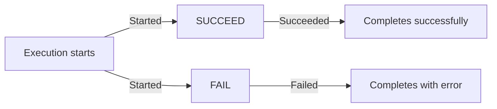
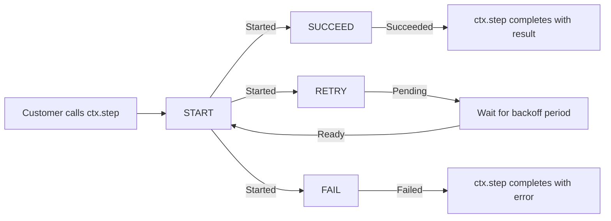
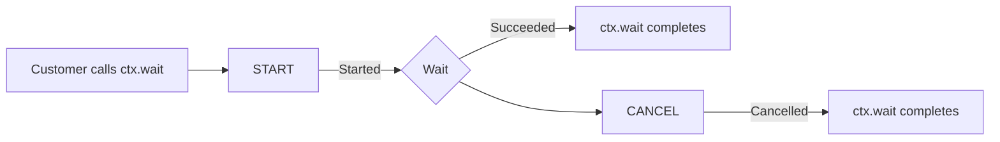
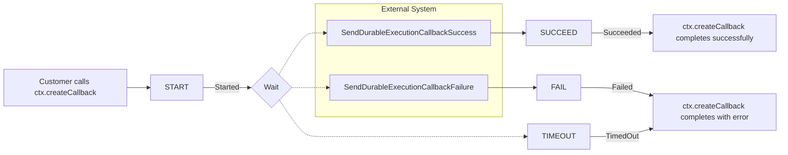
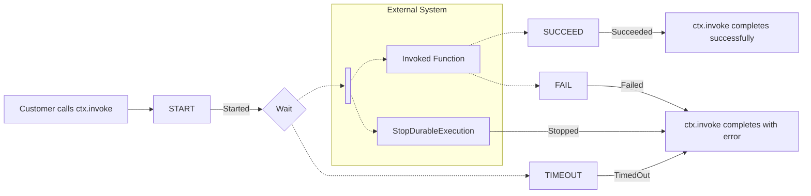
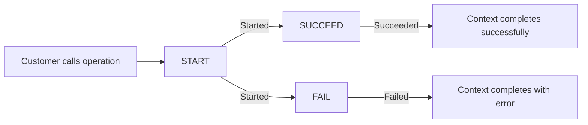

# AWS Lambda Durable Functions Language SDK Specification

**Version:** 1.2  
**Date:** December 20, 2025  
**Status:** Reviewing

## 1. Introduction

This document specifies the requirements for implementing a language SDK for AWS Lambda durable functions. The specification is language-agnostic and uses RFC 2119 terminology to define required, recommended, and optional behaviors.

### 1.1 Terminology

The key words "MUST", "MUST NOT", "REQUIRED", "SHALL", "SHALL NOT", "SHOULD", "SHOULD NOT", "RECOMMENDED", "MAY", and "OPTIONAL" in this document are to be interpreted as described in RFC 2119.

### 1.2 Scope

This specification covers:

- Core execution model and architecture
- Required operations and their semantics
- Checkpoint and replay mechanisms
- Error handling requirements
- State management

This specification does NOT prescribe:

- Language-specific implementation patterns (decorators, wrappers, middleware, etc.)
- Internal data structures or class hierarchies
- Logging frameworks or monitoring integrations
- Testing frameworks or utilities

## 2. Core Concepts

### 2.1 Durable Function

A **durable function** is a Lambda function that enables developers to build resilient multi-step applications and AI workflows that can execute for extended periods while maintaining reliable progress despite interruptions. Durable functions provide primitives to checkpoint progress and suspend execution at defined points, enabling fault-tolerant and cost-effective long-running processes (up to one year).

### 2.2 Durable Execution

A **durable execution** is the end-to-end lifecycle of a durable function, using checkpoints to track progress, suspend execution, and recover from failures. When functions resume after suspension or interruptions, the system performs replay, automatically re-executing the event handler from the beginning while skipping completed checkpoints and continuing from the point of interruption. The lifecycle may include multiple sub-invocations (Lambda function invocations that occur when resuming after wait operations, retries, or infrastructure failures) to complete the execution.

### 2.3 Checkpoint and Replay

SDKs MUST implement a checkpoint-and-replay execution model:

1. **Checkpoint**: During execution, the SDK periodically persists operation state to the Lambda durable execution service
2. **Replay**: When a function resumes after interruption, it re-executes from the beginning but skips operations that have already completed by using their checkpointed results

### 2.4 Durable Operation

A **durable operation** is a fundamental unit representing checkpoints within a durable function to persist progress and suspend execution at defined points. Operations are the building blocks that enable durable functions to:

- Track progress with unique identifiers
- Transition through various states (STARTED, PENDING, READY, SUCCEEDED, FAILED, etc.)
- Be checkpointed and resumed
- Maintain execution state across interruptions

The two core durable operation primitives are:

**Step**: A core durable operation primitive that executes business logic with built-in retries and progress tracking, ensuring fault tolerance.

**Wait**: A core durable operation primitive that suspends a durable function without incurring compute charges during the suspension period, enabling cost-effective implementation of long-running processes such as human-in-the-loop workflows, scheduled tasks, or polling external system dependencies.

### 2.5 Determinism Requirements

For correct replay behavior, **user code MUST be deterministic**:

1. Non-durable code (code outside operations) MUST execute identically on each replay
2. User code MUST NOT use non-deterministic values (e.g., `Date.now()`, `Math.random()`) outside durable operations
3. User code MUST NOT perform side effects (e.g., API calls, database writes) outside durable operations affecting operation order
4. Operation order MUST remain consistent across replays

**Note:** User code MAY perform side effects outside durable operations as long as those side effects do not influence the order or execution of durable operations. For example, logging is acceptable, but using an API response to conditionally skip an operation is not.

**SDK Responsibilities for Determinism:**

The SDK MUST:

- Document determinism requirements clearly and prominently
- Explain common determinism pitfalls and how to avoid them
- Provide examples of correct and incorrect patterns

The SDK SHOULD:

- Provide linting rules or analysis tools to detect common non-deterministic patterns
- Include warnings in documentation about replay behavior
- Offer testing utilities that can help validate deterministic behavior

The SDK is not responsible for:

- Preventing users from writing non-deterministic code
- Detecting all forms of non-determinism
- Guaranteeing that user code will execute deterministically

**Note:** Some languages have inherently non-deterministic constructs that may require alternatives:

- Java: Use `LinkedHashMap` instead of `HashMap` (iteration order is not guaranteed)
- Go: Map iteration order is purposefully randomized
- Other languages may have similar constructs requiring deterministic alternatives

**SDK Guarantees During Replay:**

The SDK MUST ensure:

- Durable operations return the same checkpointed results they produced originally
- Operation IDs and execution order remain consistent
- No side effects occur during replay for already-completed operations (operations are skipped, not re-executed)

## 3. Execution Lifecycle

### 3.1 Invocation Input

When a durable function is invoked, the SDK MUST process an input payload with the following structure:

```json
{
  "DurableExecutionArn": "string",
  "CheckpointToken": "string",
  "InitialExecutionState": {
    "Operations": [
      /* Operation objects */
    ],
    "NextMarker": "string (optional)"
  }
}
```

#### 3.1.1 Required Behavior

The SDK MUST:

1. Extract the `DurableExecutionArn` and `CheckpointToken` for API calls
2. Load all operations from `InitialExecutionState.Operations`
3. If `NextMarker` is present, paginate through `GetDurableExecutionState` API to retrieve all operation state
4. Build an internal representation of the execution state

### 3.2 Invocation Output

The SDK MUST return an output payload in one of three forms:

#### 3.2.1 Successful Completion

```json
{
  "Status": "SUCCEEDED",
  "Result": "string (optional)"
}
```

The `Result` field is a string and MAY be JSON-formatted.

#### 3.2.2 Failed Completion

```json
{
  "Status": "FAILED",
  "Error": {
    "ErrorType": "string (optional)",
    "ErrorMessage": "string (optional)",
    "StackTrace": ["string"], // OPTIONAL
    "ErrorData": "string" // OPTIONAL - additional machine-readable error data
  }
}
```

All Error fields are optional. For detailed error object structure, see:  
https://docs.aws.amazon.com/lambda/latest/api/API_ErrorObject.html

#### 3.2.3 Pending Continuation

```json
{
  "Status": "PENDING"
}
```

The SDK MAY return `PENDING` status when one or more operations are waiting for external completion:

- A `STEP` operation in `PENDING` status
- A `WAIT` operation in `STARTED` status
- A `CALLBACK` operation in `STARTED` status
- A `CHAINED_INVOKE` operation in `STARTED` status

The SDK is not required to return `PENDING` immediately when these conditions are true—it may continue running other work (e.g., if a long-running STEP is in progress concurrently).

The SDK MUST NOT return `PENDING` when no operations are pending, as this results in execution failure.

### 3.3 Execution State Management

#### 3.3.1 State Initialization

At the start of each invocation, the SDK MUST:

1. Load all operation state from the input payload
2. Paginate through `GetDurableExecutionState` if needed
3. Index operations by their unique IDs
4. Determine replay vs. new execution mode

#### 3.3.2 Replay Detection

The SDK MUST determine if an operation has already been executed by checking:

- Whether the operation ID exists in the loaded state
- The operation's current status
- Whether a result or error is already recorded

#### 3.3.3 Operation Consistency Checks

The SDK MUST verify operation consistency when encountering an existing operation:

- If an operation ID already exists, the SDK MUST verify the operation type matches
- For example, if an existing operation with ID "op1" is a STEP, the SDK MUST NOT allow a new CALLBACK or WAIT operation to use the same ID
- Mismatched operation types indicate a determinism violation and SHOULD result in a terminal error

### 3.4 Response Size and Error Handling

The SDK MUST handle API size limit errors gracefully:

1. When serialization or API calls fail due to size constraints, the SDK MUST:
   - Catch the error from the API
   - Return `FAILED` status with a clear error message
   - NOT allow the error to propagate and trigger invocation-level retries

2. Exception: `InvalidParameterValueException` for checkpoint tokens SHOULD be allowed to propagate, as this indicates a transient issue that may resolve on retry.

3. For large execution results that would exceed response size limits, the SDK MUST:
   - Checkpoint the result using an `EXECUTION` operation with `SUCCEED` action
   - Return an empty `Result` field with `SUCCEEDED` status

Note: Specific size limits are subject to change. Refer to AWS Lambda service limits documentation for current values.

## 4. Durable Operations

### 4.1 Operation Types

SDKs MUST support the following operation types:

**Five User-Facing Primitives:**

1. **STEP** - Execute code with automatic retry and checkpointing
2. **WAIT** - Pause execution for a specified duration
3. **CALLBACK** - Wait for external system completion
4. **CHAINED_INVOKE** - Invoke another Lambda function
5. **CONTEXT** - Group operations with isolated state

**Special Operation:**

6. **EXECUTION** - Represents the execution itself (used only to complete the overall execution, not a user-facing primitive)

For detailed operation definitions, refer to the AWS Lambda API documentation:  
https://docs.aws.amazon.com/lambda/latest/api/API_Operation.html

#### 4.1.1 API Primitives vs SDK Constructs

The five user-facing operation types listed above are **API primitives** defined by the AWS Lambda Durable Execution API. These are the fundamental building blocks provided by the service.

The SDK MAY provide **higher-level constructs** that compose these primitives to offer convenient patterns:

- `map` - Concurrent processing of items (uses CONTEXT operations)
- `parallel` - Concurrent execution of branches (uses CONTEXT operations)
- `waitForCondition` - Polling with state accumulation (uses STEP with RETRY)
- `waitForCallback` - Callback with submission logic (uses CALLBACK primitive)

These constructs exist only in the SDK layer and are built upon the core API primitives. They are not separate operation types in the API.

### 4.2 Common Operation Properties

All operations MUST have:

- `Id`: Unique identifier (string)
- `Type`: Operation type (enum)
- `Status`: Current status (enum)
- `StartTimestamp`: When the operation started (number)

All operations MAY have:

- `Name`: Human-readable name (string)
- `ParentId`: ID of parent CONTEXT operation (string)
- `SubType`: Categorization for SDK constructs (string)
- `EndTimestamp`: When the operation completed (number)

### 4.3 EXECUTION Operation

#### 4.3.1 Purpose

Represents the overall execution and provides access to the original invocation input.

#### 4.3.2 Required Behavior

The SDK MUST:

- Recognize the first operation in state as the EXECUTION operation
- Extract the original user input from `ExecutionDetails.InputPayload`
- Support completing the execution via checkpointing (as an alternative to return value)

#### 4.3.3 Supported Actions

- `SUCCEED`: Complete execution successfully with a result
- `FAIL`: Complete execution with an error

#### 4.3.4 State Transitions



Note: The EXECUTION operation is always in STARTED status when the handler begins. It does not have a START action.

### 4.4 STEP Operation

#### 4.4.1 Purpose

Execute a function with automatic checkpointing, retry logic, and result persistence.

#### 4.4.2 Required Behavior

The SDK MUST:

1. Generate a unique ID for each step
2. Check if the step has already been executed (replay)
3. If replaying, return the checkpointed result without re-execution
4. If new, execute the provided function
5. Checkpoint the result or error
6. Handle retry logic with configurable backoff

#### 4.4.3 Supported Actions

- `START`: Begin a new step or retry attempt
- `SUCCEED`: Complete the step successfully
- `FAIL`: Complete the step with terminal failure
- `RETRY`: Schedule a retry attempt after delay

#### 4.4.4 State Transitions



#### 4.4.5 Retry Mechanism

When a step fails, the SDK SHOULD:

1. Allow user-defined retry strategies
2. Support configurable retry counts and backoff
3. Checkpoint retry state with `RETRY` action and `NextAttemptDelaySeconds`
4. Track attempt numbers in `StepDetails.Attempt`

**Note:** The `RETRY` action can be used with either an `Error` OR a `Payload`. Using RETRY with a Payload (instead of Error) enables the "wait for condition" pattern where a step retries on success to continue polling.

The SDK MAY provide default retry presets.

### 4.5 WAIT Operation

#### 4.5.1 Purpose

Suspend execution for a specified duration without incurring compute charges.

#### 4.5.2 Required Behavior

The SDK MUST:

1. Accept duration specifications (seconds, minutes, hours, days, weeks, months, years)
2. Convert durations to total seconds for the API (minimum 1 second)
3. Create a WAIT operation with `WaitSeconds` option
4. Return immediately if the wait has already completed (replay)
5. Return pending if the wait is still active
6. Support cancellation of active waits

#### 4.5.3 Supported Actions

- `START`: Begin a wait period
- `CANCEL`: Cancel an active wait

#### 4.5.4 State Transitions



### 4.6 CALLBACK Operation

#### 4.6.1 Purpose

Enable external systems to complete an operation via API calls.

#### 4.6.2 Required Behavior

The SDK MUST:

1. Create a CALLBACK operation and retrieve its `CallbackId`
2. Provide the callback ID to the user for external completion
3. Support optional timeout and heartbeat timeout configuration
4. Handle state transitions when re-invoked (STARTED → SUCCEEDED/FAILED/TIMED_OUT)

**Note:** The callback completion APIs (`SendDurableExecutionCallbackSuccess`, `SendDurableExecutionCallbackFailure`, `SendDurableExecutionCallbackHeartbeat`) are called by external systems, not by the SDK during handler execution. The SDK's responsibility is to handle the resulting state transitions when the function is re-invoked with updated callback state.

#### 4.6.3 Supported Actions

- `START`: Create a callback waiting for external completion

#### 4.6.4 State Transitions



#### 4.6.5 Configuration Options

The SDK SHOULD support:

- `TimeoutSeconds`: Maximum time to wait for callback completion
- `HeartbeatTimeoutSeconds`: Maximum time between heartbeat signals

### 4.7 CHAINED_INVOKE Operation

#### 4.7.1 Purpose

Invoke another Lambda function (durable or non-durable) and wait for its completion.

#### 4.7.2 Required Behavior

The SDK MUST:

1. Accept function name or ARN
2. Serialize input payload
3. Create a CHAINED_INVOKE operation with the target and payload
4. Return the target function's result upon success
5. Propagate errors from the target function

**Note:** The SDK SHOULD not handle invoking durable and non-durable target functions differently. The service handles the invocation transparently.

#### 4.7.3 Supported Actions

- `START`: Invoke the target function

#### 4.7.4 State Transitions



#### 4.7.5 Configuration Options

The SDK MUST support:

- `FunctionName`: Name or ARN of the target Lambda function

The SDK MAY support:

- `TenantId`: For tenant isolation scenarios

### 4.8 CONTEXT Operation

#### 4.8.1 Purpose

Create parent-child operation relationships for isolation, concurrency control, and replay optimization.

#### 4.8.2 Required Behavior

The SDK MUST:

1. Support nesting operations within a context
2. Associate child operations with the context via `ParentId`
3. Propagate context completion to all children
4. Support conditional replay of children
5. Enable context-level error handling

#### 4.8.3 Supported Actions

- `START`: Begin a new context
- `SUCCEED`: Complete the context successfully
- `FAIL`: Complete the context with an error

#### 4.8.4 State Transitions



#### 4.8.5 ReplayChildren Option

The SDK MUST pass the `ReplayChildren` option to the API when starting a CONTEXT if it needs to access children state during replay:

- When `false` (default): Child operations are not included in state when the context is completed
- When `true`: Child operations are included in state loads for replay

**Use case:** The JS SDK uses `ReplayChildren: true` to support `parallel`/`map` operations that have a total size larger than the individual operation size limit. It requests children state and replays each branch to combine the output.

This option is particularly useful for large parallel operations where the combined result exceeds size limits.

## 5. Checkpointing

### 5.1 Checkpoint API

The SDK MUST use the `CheckpointDurableExecution` API to:

- Start new operations
- Complete existing operations (succeed, fail, retry)
- Update operation state (e.g., callback completed, wait elapsed)

### 5.2 Checkpoint Tokens

The SDK MUST:

1. Use the `CheckpointToken` from the invocation input for the first checkpoint
2. Use the returned `CheckpointToken` from each checkpoint response for subsequent checkpoints
3. Handle `InvalidParameterValueException` errors for invalid tokens (message starts with "Invalid checkpoint token")
4. Never reuse a checkpoint token that has already been consumed

### 5.3 Checkpoint Request Format

Each checkpoint request MUST include:

- `DurableExecutionArn`: The execution identifier
- `CheckpointToken`: The current valid token
- `Updates`: Array of operation updates (MAY be empty)

### 5.4 Operation Updates

Each operation update MUST include:

- `Id`: Unique identifier for the operation
- `Type`: Operation type
- `Action`: Action to perform

Each operation update MAY include:

- `Name`: Human-readable name
- `ParentId`: Parent context ID
- `SubType`: SDK-level categorization
- `Payload`: Success result (string, MAY be JSON)
- `Error`: Failure error object
- Type-specific options (`StepOptions`, `WaitOptions`, `CallbackOptions`, `ChainedInvokeOptions`, `ContextOptions`)

For detailed field constraints (length limits, patterns, and valid values), refer to the AWS Lambda API documentation:  
https://docs.aws.amazon.com/lambda/latest/api/API_OperationUpdate.html

### 5.5 Checkpoint Response

The SDK MUST process checkpoint responses that include:

- `CheckpointToken`: New token for next checkpoint
- `NewExecutionState.Operations`: Updated operation state
- `NewExecutionState.NextMarker`: Pagination token (if applicable)

### 5.6 Checkpoint Frequency

The SDK SHOULD checkpoint:

- After each durable operation starts
- After each durable operation completes
- When approaching Lambda timeout

The SDK does not need to checkpoint before returning `PENDING` status if it already knows there are only pending operations remaining.

The SDK MAY checkpoint:

- Periodically during long-running operations to receive status updates for pending operations
- With an empty `Updates` array to poll for state changes (returns any operations whose state changed since the last checkpoint)

### 5.7 Batch Checkpointing

The SDK MAY batch multiple operation updates in a single checkpoint call to reduce API calls and improve performance. When batching:

- Operations MUST be checkpointed in execution order
- EXECUTION operation completion (if used) MUST be last
- Child operations MUST be checkpointed after their parent CONTEXT starts
- Each batch can only include one update per operation ID
- **Exception:** STEP and CONTEXT operations may include both START and completion (SUCCEED/FAIL/RETRY) in the same batch, allowing a step to be started and completed in a single checkpoint call

## 6. Concurrency and Parallelism

### 6.1 Map Operation

#### 6.1.1 Purpose

Process an array of items with durable operations, with configurable concurrency.

#### 6.1.2 Required Behavior

The SDK MUST:

1. Support iterating over an array of items
2. Apply a user-provided function to each item
3. Collect results or errors for all items
4. Return a batch result structure

#### 6.1.3 Implementation Strategy

The SDK SHOULD:

1. Use a parent CONTEXT operation for the map
2. Create child CONTEXT operations for each item
3. Respect concurrency limits by starting only N items at a time
4. Track completion and handle failures according to completion policies

#### 6.1.4 Completion Policies

The SDK SHOULD support:

- `minSuccessful`: Minimum successful items required
- `toleratedFailureCount`: Maximum failures allowed
- `toleratedFailurePercentage`: Maximum failure percentage allowed

### 6.2 Parallel Operation

#### 6.2.1 Purpose

Execute multiple independent operations concurrently.

#### 6.2.2 Required Behavior

The SDK MUST:

1. Support executing an array of independent functions
2. Allow each function to contain durable operations
3. Collect results or errors for all branches
4. Return a batch result structure

#### 6.2.3 Implementation Strategy

The SDK SHOULD:

1. Use a parent CONTEXT operation for the parallel execution
2. Create child CONTEXT operations for each branch
3. Respect concurrency limits
4. Support named and unnamed branches
5. Track completion according to completion policies

### 6.3 Batch Results

#### 6.3.1 Required Information

The SDK MUST provide batch result objects that include:

- Array of all items with status (STARTED, SUCCEEDED, FAILED)
- Success count
- Failure count
- Total count
- Completion reason (all succeeded, minimum met, max failures reached, etc.)

#### 6.3.2 Result Access

The SDK SHOULD provide convenient methods to:

- Get all successful results
- Get all errors
- Get all items
- Check if any failures occurred
- Throw if errors exist (fail-fast option)

## 7. Advanced Operations

### 7.1 Wait for Condition

#### 7.1.1 Purpose

Repeatedly check a condition until it is met, with configurable wait intervals.

#### 7.1.2 Implementation Strategy

The SDK SHOULD implement wait-for-condition as:

1. A single STEP operation that acts as a reducer pattern
2. Each check attempt uses the STEP's retry mechanism via RETRY action
3. The condition check function returns state that is passed as the payload
4. On retry, the previous payload (state) is passed to the next attempt (not an error)
5. The retry delay (NextAttemptDelaySeconds) creates the wait period between checks
6. No separate WAIT or CONTEXT operations are required

The SDK MAY provide built-in wait strategies (exponential backoff, linear, constant, etc.).

### 7.2 Callback Patterns

The callback patterns described here are SDK constructs built on the CALLBACK operation primitive. They provide convenient wrappers around the core CALLBACK functionality.

#### 7.2.1 Create Callback

The SDK SHOULD provide a pattern where:

1. A CALLBACK operation is created
2. The callback ID is provided to the user
3. A promise/future is returned that resolves when the callback completes
4. The user can submit the callback ID to external systems

#### 7.2.2 Wait for Callback

The SDK SHOULD provide a pattern where:

1. A CALLBACK operation is created
2. A user-provided function receives the callback ID
3. The function submits the ID to external systems
4. The operation waits for external completion
5. Retry logic can be applied to the submission function

### 7.3 Promise Combinators

#### 7.3.1 Purpose

Coordinate multiple durable promises in familiar patterns.

#### 7.3.2 Supported Combinators

The SDK SHOULD provide equivalents to common promise patterns:

- **all**: Wait for all promises to complete successfully
- **allSettled**: Wait for all promises to settle (success or failure)
- **race**: Return the first promise to settle
- **any**: Return the first promise to succeed

#### 7.3.3 Implementation Considerations

The SDK SHOULD:

1. Document that combinators work with already-started operations
2. Recommend map/parallel for controlled concurrency and durability
3. Implement combinators using a STEP operation to track and resolve results
4. Support proper error propagation and result collection

**Note:** Promise combinators MUST be implemented within a STEP operation to ensure durability. The STEP provides the checkpoint mechanism for tracking which promises have resolved.

## 8. Error Handling

### 8.1 Error Classification

Lambda classifies errors into two categories:

1. **Runtime Errors**: Errors in the execution environment
   - Prefixed with `Runtime.`, `Sandbox.`, or `Extension.`
   - Automatically retried by Lambda (up to 3 immediate retries)
   - Exception: `Sandbox.Timedout` is treated as handler error
   - These occur outside the handler context and the SDK is not directly involved

2. **Handler Errors**: Errors thrown by or returned from the handler
   - All other error types
   - Retried with exponential backoff over several hours
   - The SDK controls whether errors are thrown (retryable) or returned as FAILED status (terminal)

### 8.2 Error Recovery

#### 8.2.1 Retryable vs Terminal Errors

The SDK controls error handling through its return behavior:

**Retryable Errors (throw from handler):**

- When the SDK throws an error from the handler, Lambda will retry the invocation
- The SDK SHOULD throw errors when:
  - The error is transient and may resolve on retry
  - The SDK wants Lambda to re-invoke the function

**Terminal Errors (return FAILED status):**

- When the SDK returns `FAILED` status, the execution terminates permanently
- The SDK MUST return `FAILED` status when:
  - User explicitly requests failure
  - Retry budget is exhausted (step retries exhausted)
  - Operation reaches terminal failed state
  - Unrecoverable validation or serialization errors
  - Non-retryable API errors (size limit exceeded, etc.)

### 8.3 Error Propagation

#### 8.3.1 Step Errors

When a step fails:

1. The SDK SHOULD check the retry strategy
2. If retry is requested, checkpoint with `RETRY` action
3. If retry is exhausted, checkpoint with `FAIL` action and propagate error

#### 8.3.2 Context Errors

When a child operation fails within a context:

1. The SDK SHOULD allow context-level error handling
2. The SDK MAY cancel other pending operations in the context
3. The SDK MUST checkpoint the context failure if not recovered

#### 8.3.3 Error Objects

The SDK MUST provide error objects with:

- `ErrorType`: String identifying the error class (optional)
- `ErrorMessage`: Human-readable error description (optional)

The SDK SHOULD include:

- `StackTrace`: Array of stack frame strings
- `ErrorData`: Additional machine-readable error information (MAY be serialized JSON)

For the complete error object structure, see:  
https://docs.aws.amazon.com/lambda/latest/api/API_ErrorObject.html

## 9. Serialization

### 9.1 Requirements

The SDK MUST:

1. Serialize operation inputs and outputs to JSON strings
2. Support primitive types (string, number, boolean, null)
3. Support complex types (objects, arrays)
4. Handle serialization errors gracefully

### 9.2 Custom Serialization

The SDK SHOULD:

1. Allow users to provide custom serialization strategies
2. Support language-specific types (dates, custom classes, etc.)
3. Document serialization requirements for deterministic replay

### 9.3 Deserialization

The SDK MUST:

1. Deserialize checkpointed results during replay
2. Restore the original type when possible
3. Handle deserialization errors as terminal failures

## 10. Logging and Observability

### 10.1 Logging Interface

The SDK SHOULD provide a logger that:

1. Integrates with the platform's logging framework
2. Includes execution context in log entries
3. Supports standard log levels (debug, info, warn, error)
4. Can be customized by users

### 10.2 Execution Context

The SDK SHOULD include in logs:

- `DurableExecutionArn`: Execution identifier
- `OperationId`: Current operation identifier
- `RequestId`: Lambda request identifier

### 10.3 Replay-Aware Logging

The SDK SHOULD:

1. Detect replay mode
2. Optionally suppress logs during replay
3. Allow users to configure replay logging behavior

## 11. Type Safety and Language Integration

### 11.1 Type Parameters

The SDK SHOULD provide type-safe interfaces where the language supports it:

1. Generic/parameterized types for inputs and outputs
2. Type inference for operation results
3. Compile-time validation of operation signatures

### 11.2 Async Patterns

The SDK SHOULD integrate with the language's asynchronous programming model where appropriate:

- JavaScript/TypeScript: Promises
- Python: asyncio/coroutines
- Go: goroutines/channels
- Java: CompletableFuture, virtual threads (Java 21)
- Rust: async/await

**Note:** Integration with async primitives is not mandatory. SDKs MAY provide synchronous-only implementations or alternative concurrency models based on language idioms and use case requirements.

### 11.3 Error Handling Idioms

The SDK SHOULD use idiomatic error handling:

- Languages with exceptions: throw/catch
- Languages with result types: Result<T, E>
- Languages with multiple returns: (value, error)

## 12. Handler Registration

### 12.1 Integration Mechanism

The SDK MUST provide a mechanism to:

1. Register a user's durable handler function
2. Process the durable execution input format
3. Initialize execution state
4. Execute the handler with a durable context
5. Return the required output format

### 12.2 Implementation Patterns

The SDK MAY use language-appropriate patterns:

- Decorators (Python, TypeScript)
- Wrapper functions (JavaScript, Go)
- Middleware (Node.js frameworks)
- Macros (Rust)
- Annotations (Java)

### 12.3 Configuration

The SDK SHOULD allow configuration of:

- Custom Lambda client
- Default retry strategies
- Logging configuration
- Serialization strategies

## 13. Performance Considerations

### 13.1 Memory Usage

The SDK SHOULD:

1. Process large state incrementally when possible
2. Release completed operation data when safe
3. Use efficient data structures for operation tracking

### 13.2 Cold Start

The SDK SHOULD:

1. Minimize initialization overhead
2. Defer non-essential initialization until needed
3. Reuse SDK client instances across invocations

## 14. Limitations and Constraints

### 14.1 Execution Limits

The SDK MUST document:

- Maximum execution duration: 1 year
- Maximum response payload: 6MB
- Maximum checkpoints (durable operations): Limited by service quotas
- Maximum history size: Limited by service quotas
- Maximum concurrent operations: Limited by account quotas and function-level concurrency configuration

The SDK SHOULD gracefully handle execution limits (quotas) by returning clear error messages rather than letting unexpected failures propagate. Refer to https://docs.aws.amazon.com/lambda/latest/dg/gettingstarted-limits.html for current service limits.

### 14.2 Operation Limits

The SDK SHOULD communicate:

- Maximum and minimum wait duration
- Maximum callback timeout
- Maximum retry attempts (recommended defaults)

### 14.3 User Code Determinism Requirements

The SDK MUST document that **user code is responsible for deterministic behavior** and:

**User code MUST:**

1. NOT use non-deterministic values (e.g., `Date.now()`, `Math.random()`, UUID generation) outside durable operations
2. NOT perform side effects (API calls, database operations, file I/O) outside durable operations that affect operation order
3. Execute identically on each replay for code outside durable operations

**Note:** Side effects that do not influence operation order (e.g., logging) are acceptable outside durable operations.

**User code SHOULD:**

1. Use durable operations (step, wait, callback, etc.) for all external interactions
2. Avoid dependencies on mutable global state
3. Use deterministic algorithms and data structures
4. Be aware that the handler may be replayed multiple times

The SDK MUST provide clear documentation explaining:

- Why determinism is required (replay mechanism)
- Common sources of non-determinism
- How to refactor non-deterministic code
- Examples of correct and incorrect patterns

The SDK SHOULD provide:

- Linting rules to detect common non-deterministic patterns
- Testing utilities to validate deterministic behavior
- Runtime warnings for detected non-deterministic operations (where feasible)

The SDK MAY provide helpers to generate replay-safe non-deterministic values (e.g., deterministic UUID generators seeded by operation ID, replay-safe timestamps derived from execution state).

## 15. API Client Requirements

### 15.1 Required APIs

The SDK MUST use the following Lambda APIs:

- `CheckpointDurableExecution`: Persist operation state
- `GetDurableExecutionState`: Retrieve execution history
- `SendDurableExecutionCallbackSuccess`: Complete a callback successfully
- `SendDurableExecutionCallbackFailure`: Complete a callback with error
- `SendDurableExecutionCallbackHeartbeat`: Send callback heartbeat

### 15.2 Error Handling

The SDK MUST handle API errors:

- `InvalidParameterValueException`: Invalid checkpoint token, operation state, etc.
- `ResourceNotFoundException`: Execution not found
- `ThrottlingException`: Rate limit exceeded
- `ServiceException`: Service errors

### 15.3 Retries

The SDK SHOULD:

1. Retry transient API errors with exponential backoff
2. Propagate terminal errors immediately
3. Respect Lambda's timeout to avoid infinite retries

## 16. Execution Semantics

### 16.1 Delivery Guarantees

The durable execution system provides **at-least-once** semantics for executions:

- Operations MAY be executed more than once due to retries, timeouts, or infrastructure failures
- The SDK relies on checkpoint-and-replay to ensure operations are not re-executed when their results are already recorded
- User code within STEP operations SHOULD be idempotent to handle potential re-execution

**At-least-once implications:**

1. A STEP operation may be started multiple times before completing
2. External side effects in user code may occur more than once
3. The SDK ensures checkpointed results are returned consistently during replay

**At-most-once option:**

The SDK MAY provide STEP configuration for at-most-once semantics. With at-most-once, the step detects re-execution scenarios and may:

- Skip re-execution if the step previously succeeded (return cached result)
- Skip re-execution if the step does not checkpoint or return data (fire-and-forget)
- Fail the step if re-execution would cause duplicate side effects and no cached result exists

### 16.2 Exactly-Once Checkpoint Semantics

While execution is at-least-once, **checkpointing** provides exactly-once semantics through checkpoint tokens:

- Each checkpoint token is single-use
- Attempting to reuse a token results in `InvalidParameterValueException`
- This ensures operation state transitions are recorded exactly once

### 16.3 Checkpoint Batching Considerations

When batching multiple operation updates:

- The entire batch succeeds or fails atomically
- If a batch fails, none of the operations in the batch are recorded
- The SDK SHOULD checkpoint critical state transitions promptly rather than accumulating large batches
- For time-sensitive operations, the SDK MAY checkpoint immediately rather than batching

### 16.4 Performance vs Durability Trade-offs

SDKs MAY provide configuration options to tune the trade-off between performance and durability:

- **Eager checkpointing**: Checkpoint after every operation (maximum durability, more API calls)
- **Batched checkpointing**: Group multiple operations per checkpoint (better performance, slightly delayed durability)
- **Optimistic execution**: Execute multiple operations before checkpointing (best performance, replay may redo more work on failure)

The SDK SHOULD document the default behavior and allow users to configure based on their requirements.

## 17. Conformance

An SDK implementation conforms to this specification if it:

1. **MUST** implement all operations marked as MUST
2. **MUST** handle all required input/output formats
3. **MUST** support checkpoint and replay correctly
4. **MUST** implement error handling as specified
5. **SHOULD** implement operations marked as SHOULD
6. **MAY** implement optional extensions

### 17.1 Conformance Levels

- **Level 1 (Minimal)**: Core operations (STEP, WAIT, basic error handling)
- **Level 2 (Standard)**: All required operations, serialization, logging
- **Level 3 (Complete)**: All operations, concurrency, advanced patterns

## 18. Versioning and Compatibility

### 18.1 Specification Versioning

This specification uses semantic versioning:

- Major: Breaking changes to required behavior
- Minor: New optional features
- Patch: Clarifications and corrections

### 18.2 Backward Compatibility

SDKs SHOULD:

1. Maintain backward compatibility within major versions
2. Provide migration guides for breaking changes
3. Support gradual adoption of new features

## 19. References

### 19.1 AWS Lambda Documentation

- Lambda Durable Functions: https://docs.aws.amazon.com/lambda/latest/dg/durable-functions.html
- Lambda API Reference: https://docs.aws.amazon.com/lambda/latest/api/
- Lambda Runtime API: https://docs.aws.amazon.com/lambda/latest/dg/runtimes-api.html

### 19.2 Related Standards

- RFC 2119: Key words for use in RFCs to Indicate Requirement Levels
- JSON: ECMA-404, RFC 8259
- ISO 8601: Date and time format

## Appendix A: Example State Transitions

### A.1 Simple Step Execution

```
Invocation 1:
  - Load state: []
  - Start STEP(id="step1")
  - Checkpoint: START step1
  - Execute user function
  - Checkpoint: SUCCEED step1, payload="result"
  - Return: SUCCEEDED, Result="result"

Execution completes successfully.
```

### A.2 Step with Retry

```
Invocation 1:
  - Load state: []
  - Start STEP(id="step1")
  - Checkpoint: START step1
  - Execute user function (fails)
  - Checkpoint: RETRY step1, NextAttemptDelaySeconds=5
  - Return: PENDING

Invocation 2 (after 5 seconds):
  - Load state: [step1: READY, Attempt=2]
  - Resume STEP(id="step1") - already READY, no START checkpoint needed
  - Execute user function (succeeds)
  - Checkpoint: SUCCEED step1, payload="result"
  - Return: SUCCEEDED, Result="result"

Execution completes successfully.
```

### A.3 Wait Operation

```
Invocation 1:
  - Load state: []
  - Start WAIT(id="wait1", seconds=60)
  - Checkpoint: START wait1, WaitSeconds=60
  - Return: PENDING

Invocation 2 (after 60 seconds):
  - Load state: [wait1: SUCCEEDED]
  - Skip WAIT(id="wait1") - already completed
  - Continue execution
  - Return: SUCCEEDED, Result="done"

Execution completes successfully.
```

### A.4 Replay After Lambda Timeout

```
Invocation 1:
  - Load state: []
  - Start STEP(id="step1")
  - Checkpoint: START step1
  - Execute user function (succeeds)
  - Checkpoint: SUCCEED step1, payload="result1"
  - Start STEP(id="step2")
  - Checkpoint: START step2
  - Execute user function (long-running)
  - [Lambda timeout occurs]

Invocation 2 (Lambda retry):
  - Load state: [step1: SUCCEEDED, step2: STARTED]
  - Replay STEP(id="step1") - return cached "result1"
  - Resume STEP(id="step2")
  - Checkpoint: START step2 (same ID, continues)
  - Execute user function (succeeds)
  - Checkpoint: SUCCEED step2, payload="result2"
  - Return: SUCCEEDED, Result="result2"

Execution completes successfully.
```

## Appendix B: Common Patterns

### B.1 Sequential Steps

```
step1_result = await context.step("step1", func1)
step2_result = await context.step("step2", func2, step1_result)
step3_result = await context.step("step3", func3, step2_result)
return step3_result
```

### B.2 Human-in-the-Loop

```
[callback_promise, callback_id] = await context.create_callback("approval")
await context.step("send-email", () => send_approval_email(callback_id))
approval_result = await callback_promise
if approval_result.approved:
    return await context.step("process", process_approved)
else:
    return "rejected"
```

### B.3 External System Polling

```
await context.step("submit-job", lambda: submit_to_external_system(job_id))

result = await context.wait_for_condition(
    check_func=lambda state: check_job_status(state.job_id),
    initial_state={"job_id": job_id, "status": "pending"},
    wait_strategy=lambda state, attempt: (
        {"should_continue": False} if state.status == "complete"
        else {"should_continue": True, "delay": {"seconds": 10}}
    )
)

return result
```

### B.4 Parallel Processing

```
results = await context.parallel([
    lambda ctx: ctx.step("task1", task1_func),
    lambda ctx: ctx.step("task2", task2_func),
    lambda ctx: ctx.step("task3", task3_func)
])

for item in results.succeeded:
    process_result(item.result)
```

### B.5 Map with Concurrency Control

```
items = ["item1", "item2", "item3", "item4", "item5"]

results = await context.map(
    items,
    lambda ctx, item, index: ctx.step(f"process-{index}", lambda: process_item(item)),
    config={
        "max_concurrency": 2,
        "completion_config": {
            "min_successful": 4,
            "tolerated_failure_count": 1
        }
    }
)

return {
    "total": results.total_count,
    "succeeded": results.success_count,
    "failed": results.failure_count
}
```

### B.6 Error Recovery in Context

```
try:
    result = await context.run_in_child_context("risky-operation", async lambda ctx:
        step1 = await ctx.step("step1", risky_func1)
        step2 = await ctx.step("step2", risky_func2, step1)
        return step2
    )
    return result
except Exception as e:
    # Context failed, perform recovery
    return await context.step("fallback", lambda: fallback_operation())
```

## Appendix C: Glossary

**Checkpoint**: The act of persisting operation state to the durable execution service, enabling resume after interruption.

**Replay**: Re-executing the handler function from the beginning while skipping already-completed operations using cached results.

**Operation**: A fundamental building block representing a unit of work (STEP, WAIT, CALLBACK, etc.) that can be checkpointed and resumed.

**Durable Context**: The execution context provided to handler functions, offering access to durable operations.

**Checkpoint Token**: A one-time-use token that ensures consistency when checkpointing updates. Each successful checkpoint returns a new token.

**Execution State**: The complete set of all operations and their current status for a durable execution.

**Terminal State**: An operation status from which no further transitions are possible (SUCCEEDED, FAILED, CANCELLED, TIMED_OUT, STOPPED).

**Parent-Child Relationship**: Association between CONTEXT operations and their nested operations via ParentId.

**Deterministic Execution**: Execution where the same inputs always produce the same outputs, critical for correct replay behavior.

**Batch Result**: Result object from map/parallel operations containing success/failure counts and individual item results.

**Completion Policy**: Rules determining when a batch operation (map/parallel) should stop based on success/failure counts.

## Appendix D: Change Log

### Version 1.2 (December 20, 2025)

- Clarified side-effects rule: allowed if they don't affect operation order (Sections 2.5, 14.3)
- Changed async integration from MUST to SHOULD (Section 11.2)
- Moved mermaid state diagrams into Section 4 operation definitions, removed old Appendix C
- Fixed EXECUTION state diagram to show it starts in STARTED state (no START action)

### Version 1.1 (December 9, 2025)

- Added graceful quota handling guidance (Section 14.1)
- Added replay-safe helpers for non-deterministic values (Section 14.3)
- Added at-most-once semantics option for STEP operations (Section 16.1)
- Fixed retry example to show READY state instead of re-checkpointing START (Appendix A.2)
- Fixed Human-in-the-Loop example to wrap side effect in step (Appendix B.2)
- Removed State Loading section (implementation detail)
- Changed status to Reviewing

### Version 1.0 (December 6, 2025)

- Initial specification release
- Core operations: EXECUTION, STEP, WAIT, CALLBACK, CHAINED_INVOKE, CONTEXT
- Checkpoint and replay mechanics
- Error handling requirements
- Concurrency and parallelism (map/parallel)
- Advanced operations (wait-for-condition, promise combinators)
- Serialization and type safety
- Performance considerations

---

**End of Specification Document**

